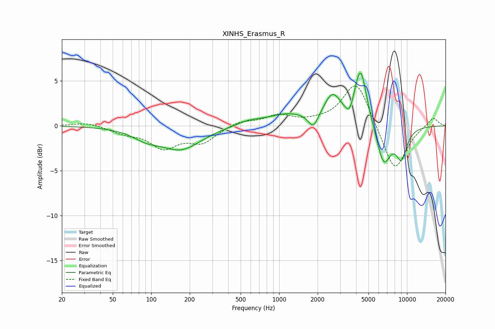

# XINHS_Erasmus_R
See [usage instructions](https://github.com/jaakkopasanen/AutoEq#usage) for more options and info.

### Parametric EQs
Apply preamp of -6.0 dB when using parametric equalizer.

|   # | Type    |   Fc (Hz) |    Q |   Gain (dB) |
|-----|---------|-----------|------|-------------|
|   1 | Peaking |        91 | 1.3  |        -1   |
|   2 | Peaking |       171 | 0.9  |        -2.5 |
|   3 | Peaking |       567 | 1.52 |         0.4 |
|   4 | Peaking |      1180 | 0.83 |         1.3 |
|   5 | Peaking |      1851 | 3.71 |        -1.6 |
|   6 | Peaking |      2609 | 2.18 |         3   |
|   7 | Peaking |      3560 | 4.54 |        -1.4 |
|   8 | Peaking |      4328 | 2.84 |         6.5 |
|   9 | Peaking |      6566 | 2.43 |        -4.4 |
|  10 | Peaking |      9043 | 2.95 |        -3.2 |

### Fixed Band EQs
When using fixed band (also called graphic) equalizer, apply preamp of **-4.5 dB** (if available) and set gains manually with these parameters.

|   # | Type    |   Fc (Hz) |    Q |   Gain (dB) |
|-----|---------|-----------|------|-------------|
|   1 | Peaking |        31 | 1.41 |         0.4 |
|   2 | Peaking |        62 | 1.41 |        -0.7 |
|   3 | Peaking |       125 | 1.41 |        -2.3 |
|   4 | Peaking |       250 | 1.41 |        -1.7 |
|   5 | Peaking |       500 | 1.41 |         0.5 |
|   6 | Peaking |      1000 | 1.41 |         1.1 |
|   7 | Peaking |      2000 | 1.41 |         0.3 |
|   8 | Peaking |      4000 | 1.41 |         5.1 |
|   9 | Peaking |      8000 | 1.41 |        -5.3 |
|  10 | Peaking |     16000 | 1.41 |         1   |

### Graphs

