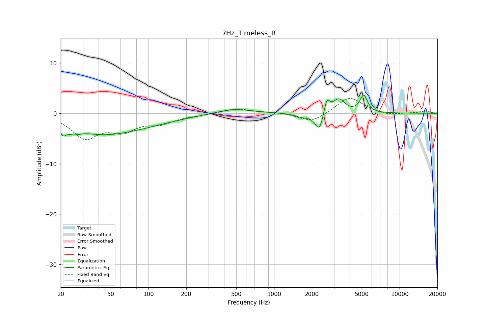

# 7Hz_Timeless_R
See [usage instructions](https://github.com/jaakkopasanen/AutoEq#usage) for more options and info.

### Parametric EQs
Apply preamp of -3.7 dB when using parametric equalizer.

|   # | Type    |   Fc (Hz) |    Q |   Gain (dB) |
|-----|---------|-----------|------|-------------|
|   1 | Peaking |        21 | 5.56 |        -1.7 |
|   2 | Peaking |        25 | 2.43 |        -1.4 |
|   3 | Peaking |        40 | 0.84 |        -1.2 |
|   4 | Peaking |        59 | 0.42 |        -3.1 |
|   5 | Peaking |       477 | 1.02 |         1   |
|   6 | Peaking |      1684 | 2.55 |        -0.7 |
|   7 | Peaking |      2301 | 4.13 |        -3.9 |
|   8 | Peaking |      2628 | 5.98 |         3.2 |
|   9 | Peaking |      3277 | 2.96 |         2.8 |
|  10 | Peaking |      5177 | 4.71 |         3.4 |

### Fixed Band EQs
When using fixed band (also called graphic) equalizer, apply preamp of **-3.0 dB** (if available) and set gains manually with these parameters.

|   # | Type    |   Fc (Hz) |    Q |   Gain (dB) |
|-----|---------|-----------|------|-------------|
|   1 | Peaking |        31 | 1.41 |        -4.6 |
|   2 | Peaking |        62 | 1.41 |        -2.9 |
|   3 | Peaking |       125 | 1.41 |        -1.7 |
|   4 | Peaking |       250 | 1.41 |        -0.3 |
|   5 | Peaking |       500 | 1.41 |         1   |
|   6 | Peaking |      1000 | 1.41 |         0.2 |
|   7 | Peaking |      2000 | 1.41 |        -1.8 |
|   8 | Peaking |      4000 | 1.41 |         3.3 |
|   9 | Peaking |      8000 | 1.41 |        -0.5 |
|  10 | Peaking |     16000 | 1.41 |         0.4 |

### Graphs

