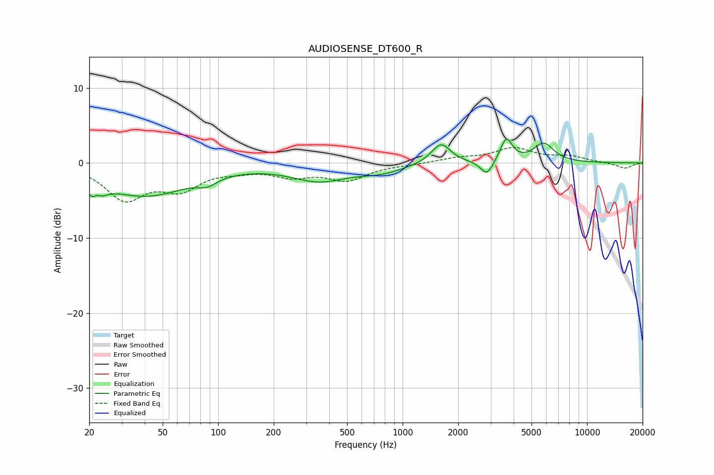

# AUDIOSENSE_DT600_R
See [usage instructions](https://github.com/jaakkopasanen/AutoEq#usage) for more options and info.

### Parametric EQs
Apply preamp of -3.3 dB when using parametric equalizer.

|   # | Type    |   Fc (Hz) |    Q |   Gain (dB) |
|-----|---------|-----------|------|-------------|
|   1 | Peaking |        22 | 3.98 |        -4.1 |
|   2 | Peaking |        22 | 5.99 |         2.4 |
|   3 | Peaking |        40 | 0.59 |        -4.3 |
|   4 | Peaking |        87 | 2.77 |        -0.9 |
|   5 | Peaking |       353 | 0.92 |        -2.2 |
|   6 | Peaking |       766 | 1.18 |        -1   |
|   7 | Peaking |      1615 | 2.72 |         2.7 |
|   8 | Peaking |      2867 | 4.19 |        -2   |
|   9 | Peaking |      3649 | 4.42 |         3.2 |
|  10 | Peaking |      5815 | 2.51 |         2.5 |

### Fixed Band EQs
When using fixed band (also called graphic) equalizer, apply preamp of **-2.1 dB** (if available) and set gains manually with these parameters.

|   # | Type    |   Fc (Hz) |    Q |   Gain (dB) |
|-----|---------|-----------|------|-------------|
|   1 | Peaking |        31 | 1.41 |        -4.6 |
|   2 | Peaking |        62 | 1.41 |        -3.1 |
|   3 | Peaking |       125 | 1.41 |        -0.7 |
|   4 | Peaking |       250 | 1.41 |        -1.5 |
|   5 | Peaking |       500 | 1.41 |        -2.1 |
|   6 | Peaking |      1000 | 1.41 |        -0.2 |
|   7 | Peaking |      2000 | 1.41 |         0.6 |
|   8 | Peaking |      4000 | 1.41 |         1.9 |
|   9 | Peaking |      8000 | 1.41 |         0.8 |
|  10 | Peaking |     16000 | 1.41 |        -0.7 |

### Graphs

