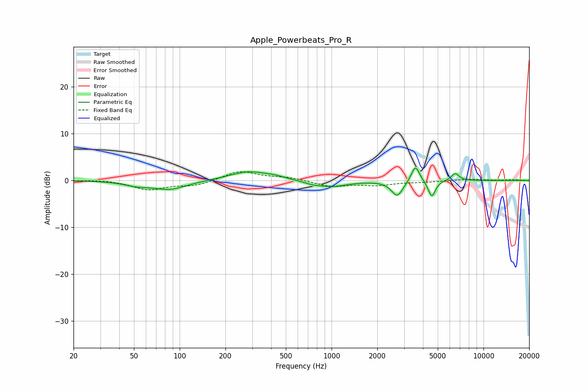

# Apple_Powerbeats_Pro_R
See [usage instructions](https://github.com/jaakkopasanen/AutoEq#usage) for more options and info.

### Parametric EQs
Apply preamp of -2.7 dB when using parametric equalizer.

|   # | Type    |   Fc (Hz) |    Q |   Gain (dB) |
|-----|---------|-----------|------|-------------|
|   1 | Peaking |        52 | 1.75 |        -0.8 |
|   2 | Peaking |        86 | 1.26 |        -1.9 |
|   3 | Peaking |       285 | 1.12 |         2   |
|   4 | Peaking |       428 | 2.53 |         0.4 |
|   5 | Peaking |       748 | 2.79 |        -0.4 |
|   6 | Peaking |       997 | 1.33 |        -1.3 |
|   7 | Peaking |      2705 | 3.8  |        -3.3 |
|   8 | Peaking |      3563 | 5.3  |         3.6 |
|   9 | Peaking |      4568 | 6    |        -3.5 |
|  10 | Peaking |      6514 | 5.43 |         1.6 |

### Fixed Band EQs
When using fixed band (also called graphic) equalizer, apply preamp of **-2.0 dB** (if available) and set gains manually with these parameters.

|   # | Type    |   Fc (Hz) |    Q |   Gain (dB) |
|-----|---------|-----------|------|-------------|
|   1 | Peaking |        31 | 1.41 |         0.2 |
|   2 | Peaking |        62 | 1.41 |        -1.9 |
|   3 | Peaking |       125 | 1.41 |        -1.1 |
|   4 | Peaking |       250 | 1.41 |         2.1 |
|   5 | Peaking |       500 | 1.41 |         0.6 |
|   6 | Peaking |      1000 | 1.41 |        -1.3 |
|   7 | Peaking |      2000 | 1.41 |        -0.9 |
|   8 | Peaking |      4000 | 1.41 |        -0.3 |
|   9 | Peaking |      8000 | 1.41 |         0.3 |
|  10 | Peaking |     16000 | 1.41 |         0.1 |

### Graphs

