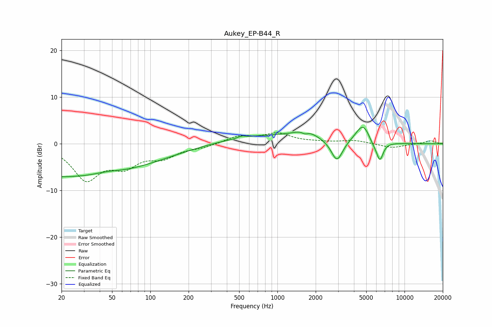

# Aukey_EP-B44_R
See [usage instructions](https://github.com/jaakkopasanen/AutoEq#usage) for more options and info.

### Parametric EQs
Apply preamp of -3.6 dB when using parametric equalizer.

|   # | Type    |   Fc (Hz) |    Q |   Gain (dB) |
|-----|---------|-----------|------|-------------|
|   1 | Peaking |        22 | 0.18 |        -7.1 |
|   2 | Peaking |        46 | 1.41 |         0.6 |
|   3 | Peaking |       523 | 5.06 |         0.4 |
|   4 | Peaking |       818 | 0.41 |         1.8 |
|   5 | Peaking |      1646 | 5.84 |        -0.7 |
|   6 | Peaking |      1665 | 1.66 |         1.7 |
|   7 | Peaking |      2939 | 3.14 |        -4.7 |
|   8 | Peaking |      4728 | 2.42 |         4.3 |
|   9 | Peaking |      5654 | 3.33 |        -1.3 |
|  10 | Peaking |      6398 | 5.21 |        -3.9 |

### Fixed Band EQs
When using fixed band (also called graphic) equalizer, apply preamp of **-2.5 dB** (if available) and set gains manually with these parameters.

|   # | Type    |   Fc (Hz) |    Q |   Gain (dB) |
|-----|---------|-----------|------|-------------|
|   1 | Peaking |        31 | 1.41 |        -7.3 |
|   2 | Peaking |        62 | 1.41 |        -4   |
|   3 | Peaking |       125 | 1.41 |        -2.5 |
|   4 | Peaking |       250 | 1.41 |        -0.7 |
|   5 | Peaking |       500 | 1.41 |         1.6 |
|   6 | Peaking |      1000 | 1.41 |         2.1 |
|   7 | Peaking |      2000 | 1.41 |         0.3 |
|   8 | Peaking |      4000 | 1.41 |         0.7 |
|   9 | Peaking |      8000 | 1.41 |        -0.9 |
|  10 | Peaking |     16000 | 1.41 |         0.7 |

### Graphs

