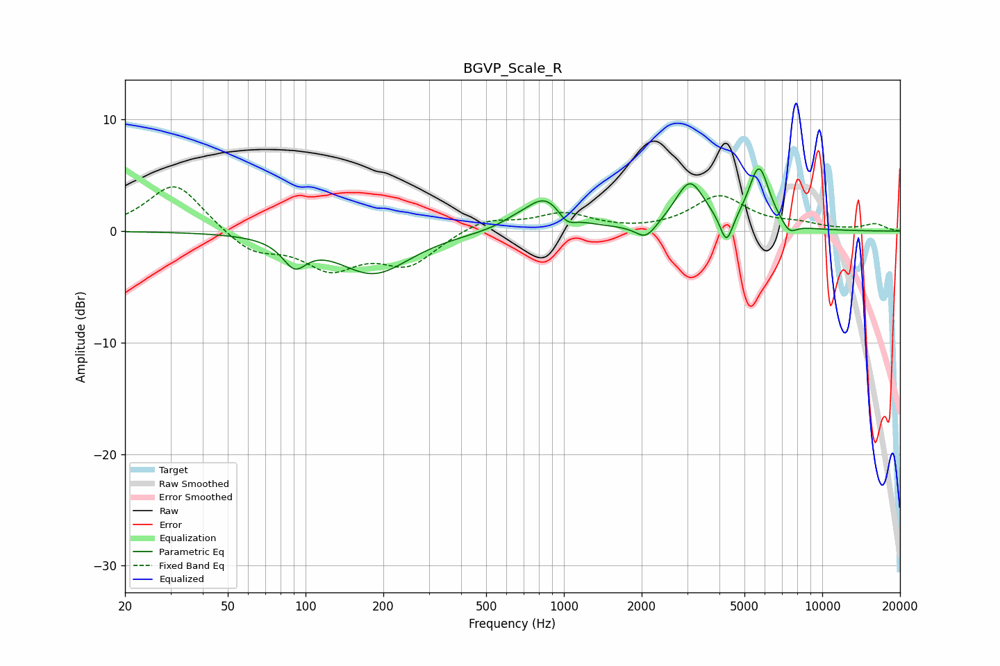

# BGVP_Scale_R
See [usage instructions](https://github.com/jaakkopasanen/AutoEq#usage) for more options and info.

### Parametric EQs
Apply preamp of -5.7 dB when using parametric equalizer.

|   # | Type    |   Fc (Hz) |    Q |   Gain (dB) |
|-----|---------|-----------|------|-------------|
|   1 | Peaking |        91 | 3.09 |        -2.3 |
|   2 | Peaking |       184 | 1.02 |        -3.8 |
|   3 | Peaking |       644 | 2.32 |         0.4 |
|   4 | Peaking |       847 | 1.82 |         3   |
|   5 | Peaking |      1024 | 4.28 |        -1.1 |
|   6 | Peaking |      2077 | 3.55 |        -1.4 |
|   7 | Peaking |      3073 | 2.45 |         4.3 |
|   8 | Peaking |      4259 | 5.8  |        -2.7 |
|   9 | Peaking |      5691 | 3.39 |         5.5 |
|  10 | Peaking |      7457 | 4.7  |        -1   |

### Fixed Band EQs
When using fixed band (also called graphic) equalizer, apply preamp of **-4.1 dB** (if available) and set gains manually with these parameters.

|   # | Type    |   Fc (Hz) |    Q |   Gain (dB) |
|-----|---------|-----------|------|-------------|
|   1 | Peaking |        31 | 1.41 |         4.4 |
|   2 | Peaking |        62 | 1.41 |        -1.9 |
|   3 | Peaking |       125 | 1.41 |        -3.1 |
|   4 | Peaking |       250 | 1.41 |        -2.8 |
|   5 | Peaking |       500 | 1.41 |         1.2 |
|   6 | Peaking |      1000 | 1.41 |         1.5 |
|   7 | Peaking |      2000 | 1.41 |        -0.1 |
|   8 | Peaking |      4000 | 1.41 |         3.1 |
|   9 | Peaking |      8000 | 1.41 |         0.5 |
|  10 | Peaking |     16000 | 1.41 |         0.6 |

### Graphs

