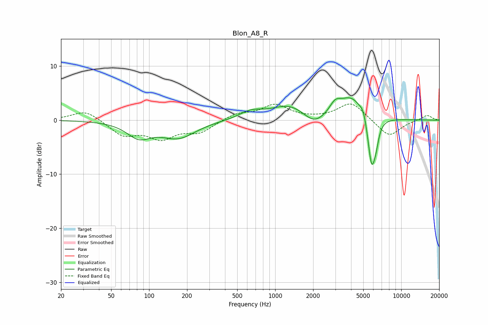

# Blon_A8_R
See [usage instructions](https://github.com/jaakkopasanen/AutoEq#usage) for more options and info.

### Parametric EQs
Apply preamp of -4.2 dB when using parametric equalizer.

|   # | Type    |   Fc (Hz) |    Q |   Gain (dB) |
|-----|---------|-----------|------|-------------|
|   1 | Peaking |        83 | 1.52 |        -2.8 |
|   2 | Peaking |       170 | 1.02 |        -3.1 |
|   3 | Peaking |       644 | 1.49 |         1.4 |
|   4 | Peaking |      1287 | 1.05 |         2.6 |
|   5 | Peaking |      2048 | 1.69 |        -2.1 |
|   6 | Peaking |      2989 | 3.25 |         1.8 |
|   7 | Peaking |      4044 | 1.38 |         4.3 |
|   8 | Peaking |      4999 | 6    |         1.3 |
|   9 | Peaking |      5815 | 4.57 |        -9.2 |
|  10 | Peaking |      6283 | 6    |        -2.5 |

### Fixed Band EQs
When using fixed band (also called graphic) equalizer, apply preamp of **-3.1 dB** (if available) and set gains manually with these parameters.

|   # | Type    |   Fc (Hz) |    Q |   Gain (dB) |
|-----|---------|-----------|------|-------------|
|   1 | Peaking |        31 | 1.41 |         1.9 |
|   2 | Peaking |        62 | 1.41 |        -2.7 |
|   3 | Peaking |       125 | 1.41 |        -3   |
|   4 | Peaking |       250 | 1.41 |        -2.1 |
|   5 | Peaking |       500 | 1.41 |         1.2 |
|   6 | Peaking |      1000 | 1.41 |         2.7 |
|   7 | Peaking |      2000 | 1.41 |         0.1 |
|   8 | Peaking |      4000 | 1.41 |         3.3 |
|   9 | Peaking |      8000 | 1.41 |        -3.1 |
|  10 | Peaking |     16000 | 1.41 |         1   |

### Graphs

