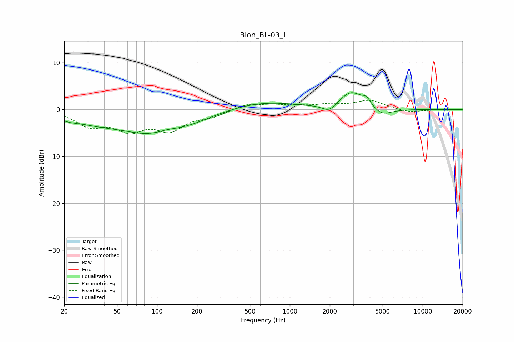

# Blon_BL-03_L
See [usage instructions](https://github.com/jaakkopasanen/AutoEq#usage) for more options and info.

### Parametric EQs
Apply preamp of -3.7 dB when using parametric equalizer.

|   # | Type    |   Fc (Hz) |    Q |   Gain (dB) |
|-----|---------|-----------|------|-------------|
|   1 | Peaking |        21 | 1.59 |        -1.1 |
|   2 | Peaking |        34 | 0.94 |        -1.3 |
|   3 | Peaking |        93 | 0.53 |        -5   |
|   4 | Peaking |       119 | 1.81 |         0.6 |
|   5 | Peaking |       191 | 0.97 |        -0.5 |
|   6 | Peaking |       626 | 0.56 |         1.7 |
|   7 | Peaking |      1976 | 2.87 |        -1.6 |
|   8 | Peaking |      2895 | 1.7  |         3.6 |
|   9 | Peaking |      3786 | 4.06 |         1.6 |
|  10 | Peaking |      4912 | 1.9  |        -1.7 |

### Fixed Band EQs
When using fixed band (also called graphic) equalizer, apply preamp of **-2.1 dB** (if available) and set gains manually with these parameters.

|   # | Type    |   Fc (Hz) |    Q |   Gain (dB) |
|-----|---------|-----------|------|-------------|
|   1 | Peaking |        31 | 1.41 |        -3.2 |
|   2 | Peaking |        62 | 1.41 |        -3.9 |
|   3 | Peaking |       125 | 1.41 |        -3.9 |
|   4 | Peaking |       250 | 1.41 |        -1.3 |
|   5 | Peaking |       500 | 1.41 |         1.3 |
|   6 | Peaking |      1000 | 1.41 |         0.7 |
|   7 | Peaking |      2000 | 1.41 |         0.9 |
|   8 | Peaking |      4000 | 1.41 |         1.9 |
|   9 | Peaking |      8000 | 1.41 |        -0.7 |
|  10 | Peaking |     16000 | 1.41 |        -0.1 |

### Graphs

