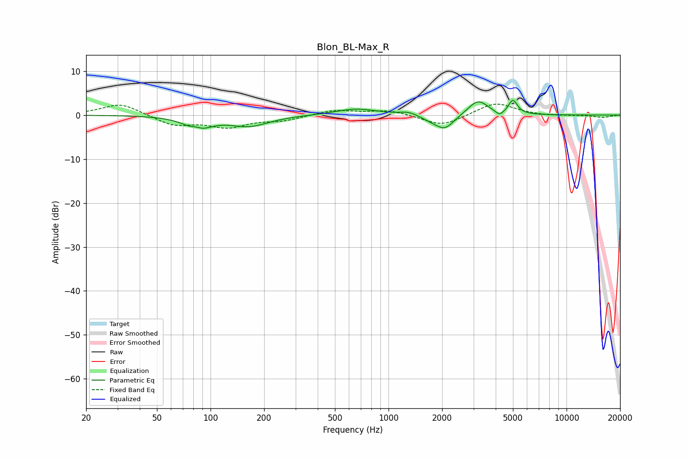

# Blon_BL-Max_R
See [usage instructions](https://github.com/jaakkopasanen/AutoEq#usage) for more options and info.

### Parametric EQs
Apply preamp of -3.5 dB when using parametric equalizer.

|   # | Type    |   Fc (Hz) |    Q |   Gain (dB) |
|-----|---------|-----------|------|-------------|
|   1 | Peaking |        83 | 4.51 |         1   |
|   2 | Peaking |        84 | 2.05 |        -3.2 |
|   3 | Peaking |       165 | 1.27 |        -2.4 |
|   4 | Peaking |       657 | 1.22 |         1.5 |
|   5 | Peaking |      1293 | 2.96 |         0.8 |
|   6 | Peaking |      1748 | 2.4  |        -0.8 |
|   7 | Peaking |      2078 | 2.69 |        -3.1 |
|   8 | Peaking |      3182 | 2.49 |         3.4 |
|   9 | Peaking |      4205 | 5.99 |        -1.2 |
|  10 | Peaking |      5002 | 5.81 |         3.2 |

### Fixed Band EQs
When using fixed band (also called graphic) equalizer, apply preamp of **-2.6 dB** (if available) and set gains manually with these parameters.

|   # | Type    |   Fc (Hz) |    Q |   Gain (dB) |
|-----|---------|-----------|------|-------------|
|   1 | Peaking |        31 | 1.41 |         2.7 |
|   2 | Peaking |        62 | 1.41 |        -2.3 |
|   3 | Peaking |       125 | 1.41 |        -2.5 |
|   4 | Peaking |       250 | 1.41 |        -1.1 |
|   5 | Peaking |       500 | 1.41 |         1.2 |
|   6 | Peaking |      1000 | 1.41 |         1.1 |
|   7 | Peaking |      2000 | 1.41 |        -2.6 |
|   8 | Peaking |      4000 | 1.41 |         2.9 |
|   9 | Peaking |      8000 | 1.41 |        -0.2 |
|  10 | Peaking |     16000 | 1.41 |        -0.6 |

### Graphs

