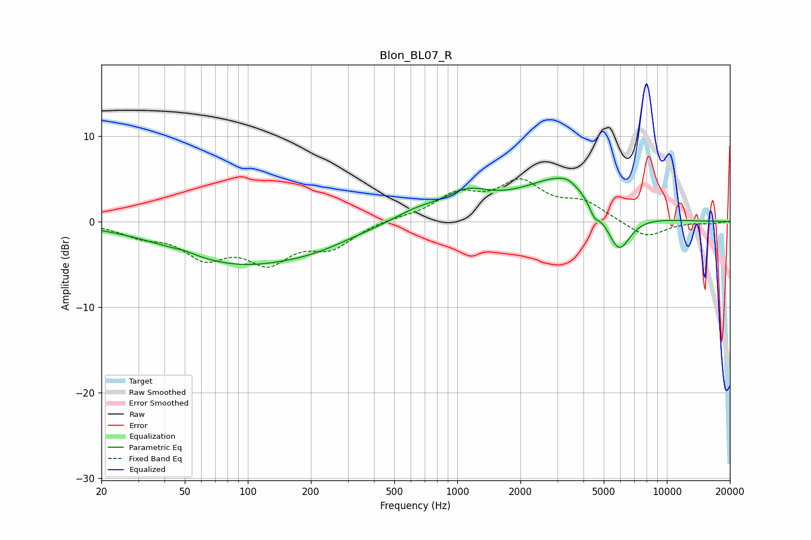

# Blon_BL07_R
See [usage instructions](https://github.com/jaakkopasanen/AutoEq#usage) for more options and info.

### Parametric EQs
Apply preamp of -5.2 dB when using parametric equalizer.

|   # | Type    |   Fc (Hz) |    Q |   Gain (dB) |
|-----|---------|-----------|------|-------------|
|   1 | Peaking |        50 | 2.89 |         0.2 |
|   2 | Peaking |        91 | 0.44 |        -4.7 |
|   3 | Peaking |       216 | 0.8  |        -1   |
|   4 | Peaking |       645 | 1.24 |         1.2 |
|   5 | Peaking |      1114 | 1.3  |         2.5 |
|   6 | Peaking |      2462 | 1.44 |        -0.6 |
|   7 | Peaking |      2919 | 0.79 |         5.3 |
|   8 | Peaking |      3381 | 3.27 |         0.5 |
|   9 | Peaking |      4512 | 6    |        -1.3 |
|  10 | Peaking |      5887 | 2.36 |        -4.9 |

### Fixed Band EQs
When using fixed band (also called graphic) equalizer, apply preamp of **-5.1 dB** (if available) and set gains manually with these parameters.

|   # | Type    |   Fc (Hz) |    Q |   Gain (dB) |
|-----|---------|-----------|------|-------------|
|   1 | Peaking |        31 | 1.41 |        -1.3 |
|   2 | Peaking |        62 | 1.41 |        -3.7 |
|   3 | Peaking |       125 | 1.41 |        -4.2 |
|   4 | Peaking |       250 | 1.41 |        -2.7 |
|   5 | Peaking |       500 | 1.41 |         0.3 |
|   6 | Peaking |      1000 | 1.41 |         2.9 |
|   7 | Peaking |      2000 | 1.41 |         4.2 |
|   8 | Peaking |      4000 | 1.41 |         2   |
|   9 | Peaking |      8000 | 1.41 |        -1.9 |
|  10 | Peaking |     16000 | 1.41 |        -0.2 |

### Graphs

