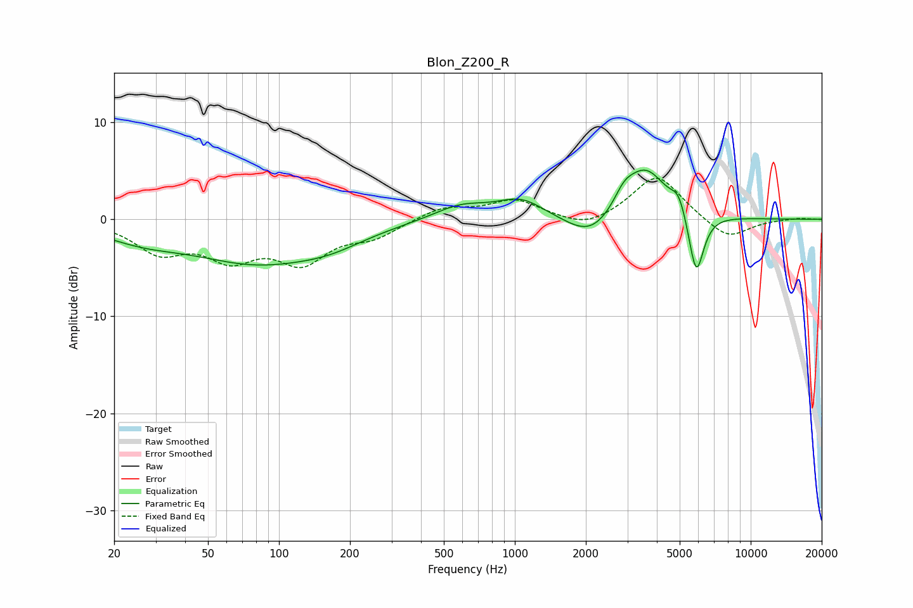

# Blon_Z200_R
See [usage instructions](https://github.com/jaakkopasanen/AutoEq#usage) for more options and info.

### Parametric EQs
Apply preamp of -5.2 dB when using parametric equalizer.

|   # | Type    |   Fc (Hz) |    Q |   Gain (dB) |
|-----|---------|-----------|------|-------------|
|   1 | Peaking |        26 | 0.81 |        -1.5 |
|   2 | Peaking |        81 | 0.51 |        -4.1 |
|   3 | Peaking |       165 | 0.95 |        -1.2 |
|   4 | Peaking |       589 | 1.21 |         1.5 |
|   5 | Peaking |      1063 | 1.41 |         2   |
|   6 | Peaking |      2104 | 1.37 |        -2.6 |
|   7 | Peaking |      2901 | 3.34 |         1.5 |
|   8 | Peaking |      3577 | 1.53 |         5.4 |
|   9 | Peaking |      4954 | 4.45 |         1.8 |
|  10 | Peaking |      5876 | 4.26 |        -6.7 |

### Fixed Band EQs
When using fixed band (also called graphic) equalizer, apply preamp of **-4.3 dB** (if available) and set gains manually with these parameters.

|   # | Type    |   Fc (Hz) |    Q |   Gain (dB) |
|-----|---------|-----------|------|-------------|
|   1 | Peaking |        31 | 1.41 |        -3.1 |
|   2 | Peaking |        62 | 1.41 |        -3.5 |
|   3 | Peaking |       125 | 1.41 |        -4   |
|   4 | Peaking |       250 | 1.41 |        -1.6 |
|   5 | Peaking |       500 | 1.41 |         1.3 |
|   6 | Peaking |      1000 | 1.41 |         1.9 |
|   7 | Peaking |      2000 | 1.41 |        -1.1 |
|   8 | Peaking |      4000 | 1.41 |         4.7 |
|   9 | Peaking |      8000 | 1.41 |        -2.2 |
|  10 | Peaking |     16000 | 1.41 |         0.1 |

### Graphs

