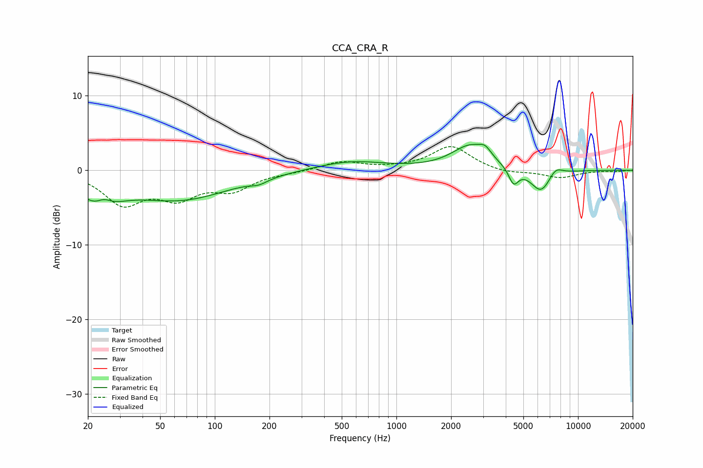

# CCA_CRA_R
See [usage instructions](https://github.com/jaakkopasanen/AutoEq#usage) for more options and info.

### Parametric EQs
Apply preamp of -3.6 dB when using parametric equalizer.

|   # | Type    |   Fc (Hz) |    Q |   Gain (dB) |
|-----|---------|-----------|------|-------------|
|   1 | Peaking |        23 | 1.43 |        -4   |
|   2 | Peaking |        24 | 3.13 |         1.6 |
|   3 | Peaking |        64 | 0.51 |        -3.8 |
|   4 | Peaking |       175 | 2.96 |        -0.6 |
|   5 | Peaking |       558 | 0.74 |         1.2 |
|   6 | Peaking |      2566 | 1.37 |         3.2 |
|   7 | Peaking |      3083 | 4.51 |         1   |
|   8 | Peaking |      4417 | 5.21 |        -2.2 |
|   9 | Peaking |      6256 | 2.38 |        -3.1 |
|  10 | Peaking |      7505 | 3.51 |         1.2 |

### Fixed Band EQs
When using fixed band (also called graphic) equalizer, apply preamp of **-3.3 dB** (if available) and set gains manually with these parameters.

|   # | Type    |   Fc (Hz) |    Q |   Gain (dB) |
|-----|---------|-----------|------|-------------|
|   1 | Peaking |        31 | 1.41 |        -4.2 |
|   2 | Peaking |        62 | 1.41 |        -3.2 |
|   3 | Peaking |       125 | 1.41 |        -2.3 |
|   4 | Peaking |       250 | 1.41 |        -0.2 |
|   5 | Peaking |       500 | 1.41 |         1.2 |
|   6 | Peaking |      1000 | 1.41 |         0.2 |
|   7 | Peaking |      2000 | 1.41 |         3.2 |
|   8 | Peaking |      4000 | 1.41 |        -0.5 |
|   9 | Peaking |      8000 | 1.41 |        -1   |
|  10 | Peaking |     16000 | 1.41 |        -0.1 |

### Graphs

