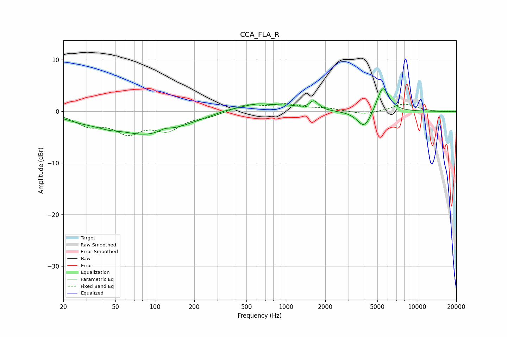

# CCA_FLA_R
See [usage instructions](https://github.com/jaakkopasanen/AutoEq#usage) for more options and info.

### Parametric EQs
Apply preamp of -4.5 dB when using parametric equalizer.

|   # | Type    |   Fc (Hz) |    Q |   Gain (dB) |
|-----|---------|-----------|------|-------------|
|   1 | Peaking |        29 | 0.96 |        -1.2 |
|   2 | Peaking |        44 | 2.08 |        -0.5 |
|   3 | Peaking |        92 | 0.55 |        -4.4 |
|   4 | Peaking |       118 | 2.85 |         0.7 |
|   5 | Peaking |       345 | 1.64 |         0.4 |
|   6 | Peaking |       607 | 1.03 |         1.6 |
|   7 | Peaking |      1053 | 2.03 |         0.6 |
|   8 | Peaking |      1640 | 4.15 |         1.8 |
|   9 | Peaking |      3977 | 2.6  |        -3.5 |
|  10 | Peaking |      5503 | 3.04 |         5.2 |

### Fixed Band EQs
When using fixed band (also called graphic) equalizer, apply preamp of **-1.6 dB** (if available) and set gains manually with these parameters.

|   # | Type    |   Fc (Hz) |    Q |   Gain (dB) |
|-----|---------|-----------|------|-------------|
|   1 | Peaking |        31 | 1.41 |        -2.4 |
|   2 | Peaking |        62 | 1.41 |        -3.6 |
|   3 | Peaking |       125 | 1.41 |        -3.2 |
|   4 | Peaking |       250 | 1.41 |        -0.8 |
|   5 | Peaking |       500 | 1.41 |         1.3 |
|   6 | Peaking |      1000 | 1.41 |         1.2 |
|   7 | Peaking |      2000 | 1.41 |         0.5 |
|   8 | Peaking |      4000 | 1.41 |        -0.7 |
|   9 | Peaking |      8000 | 1.41 |         1.5 |
|  10 | Peaking |     16000 | 1.41 |        -0.1 |

### Graphs

