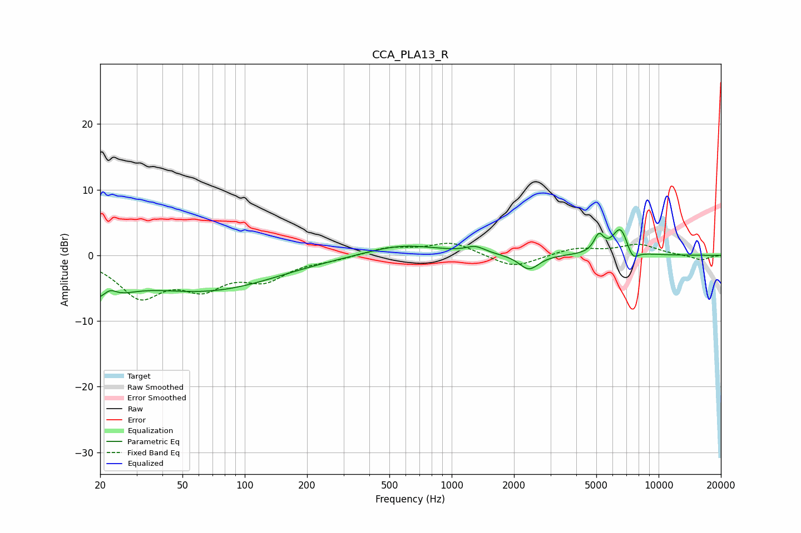

# CCA_PLA13_R
See [usage instructions](https://github.com/jaakkopasanen/AutoEq#usage) for more options and info.

### Parametric EQs
Apply preamp of -4.0 dB when using parametric equalizer.

|   # | Type    |   Fc (Hz) |    Q |   Gain (dB) |
|-----|---------|-----------|------|-------------|
|   1 | Peaking |        20 | 1.33 |        -5.3 |
|   2 | Peaking |        22 | 3.93 |         1.9 |
|   3 | Peaking |        66 | 0.41 |        -5.2 |
|   4 | Peaking |       188 | 1.05 |         0.1 |
|   5 | Peaking |       574 | 0.78 |         1.7 |
|   6 | Peaking |      1303 | 3.11 |         1   |
|   7 | Peaking |      2364 | 2.97 |        -2.3 |
|   8 | Peaking |      5144 | 5.98 |         2.6 |
|   9 | Peaking |      6555 | 3.5  |         4.3 |
|  10 | Peaking |      7453 | 4.54 |        -2   |

### Fixed Band EQs
When using fixed band (also called graphic) equalizer, apply preamp of **-1.9 dB** (if available) and set gains manually with these parameters.

|   # | Type    |   Fc (Hz) |    Q |   Gain (dB) |
|-----|---------|-----------|------|-------------|
|   1 | Peaking |        31 | 1.41 |        -5.9 |
|   2 | Peaking |        62 | 1.41 |        -4.2 |
|   3 | Peaking |       125 | 1.41 |        -3.3 |
|   4 | Peaking |       250 | 1.41 |        -0.5 |
|   5 | Peaking |       500 | 1.41 |         1.2 |
|   6 | Peaking |      1000 | 1.41 |         2   |
|   7 | Peaking |      2000 | 1.41 |        -2   |
|   8 | Peaking |      4000 | 1.41 |         1.1 |
|   9 | Peaking |      8000 | 1.41 |         1.6 |
|  10 | Peaking |     16000 | 1.41 |        -0.7 |

### Graphs

