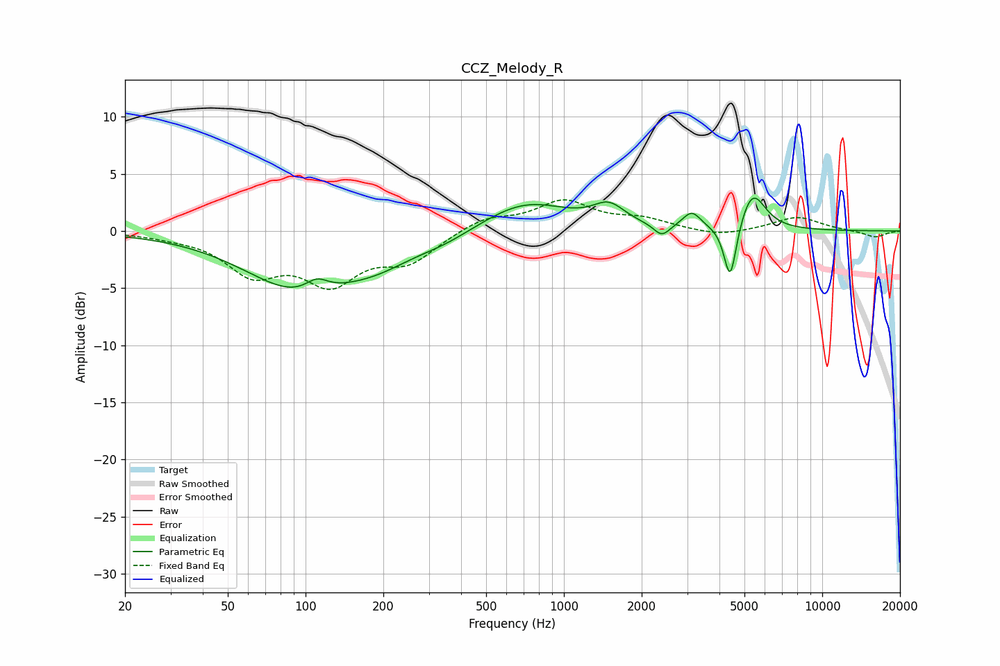

# CCZ_Melody_R
See [usage instructions](https://github.com/jaakkopasanen/AutoEq#usage) for more options and info.

### Parametric EQs
Apply preamp of -3.0 dB when using parametric equalizer.

|   # | Type    |   Fc (Hz) |    Q |   Gain (dB) |
|-----|---------|-----------|------|-------------|
|   1 | Peaking |        94 | 0.67 |        -4.9 |
|   2 | Peaking |       111 | 3.17 |         1.2 |
|   3 | Peaking |       190 | 0.92 |        -1.6 |
|   4 | Peaking |       345 | 1.34 |        -0.6 |
|   5 | Peaking |       711 | 0.85 |         2.6 |
|   6 | Peaking |      1494 | 2.27 |         1.7 |
|   7 | Peaking |      2393 | 4.56 |        -1.1 |
|   8 | Peaking |      3125 | 4.07 |         1.4 |
|   9 | Peaking |      4405 | 5.8  |        -5.2 |
|  10 | Peaking |      5370 | 2.81 |         3.4 |

### Fixed Band EQs
When using fixed band (also called graphic) equalizer, apply preamp of **-2.8 dB** (if available) and set gains manually with these parameters.

|   # | Type    |   Fc (Hz) |    Q |   Gain (dB) |
|-----|---------|-----------|------|-------------|
|   1 | Peaking |        31 | 1.41 |        -0.3 |
|   2 | Peaking |        62 | 1.41 |        -3.4 |
|   3 | Peaking |       125 | 1.41 |        -4.1 |
|   4 | Peaking |       250 | 1.41 |        -2.4 |
|   5 | Peaking |       500 | 1.41 |         1.2 |
|   6 | Peaking |      1000 | 1.41 |         2.5 |
|   7 | Peaking |      2000 | 1.41 |         0.9 |
|   8 | Peaking |      4000 | 1.41 |        -0.5 |
|   9 | Peaking |      8000 | 1.41 |         1.2 |
|  10 | Peaking |     16000 | 1.41 |        -0.6 |

### Graphs

