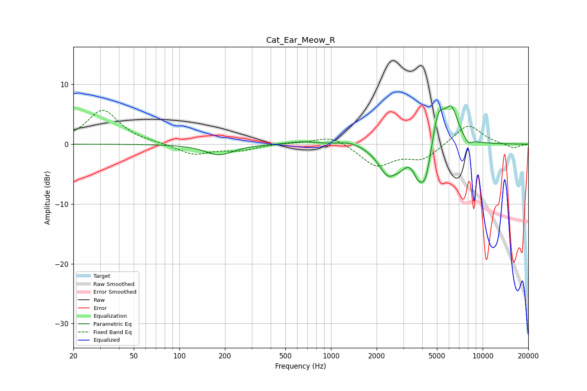

# Cat_Ear_Meow_R
See [usage instructions](https://github.com/jaakkopasanen/AutoEq#usage) for more options and info.

### Parametric EQs
Apply preamp of -6.5 dB when using parametric equalizer.

|   # | Type    |   Fc (Hz) |    Q |   Gain (dB) |
|-----|---------|-----------|------|-------------|
|   1 | Peaking |       183 | 1.52 |        -1.8 |
|   2 | Peaking |       646 | 1.53 |         0.5 |
|   3 | Peaking |      1335 | 1.86 |         0.7 |
|   4 | Peaking |      2376 | 2.2  |        -4.7 |
|   5 | Peaking |      2867 | 3.42 |        -1.4 |
|   6 | Peaking |      3739 | 4.45 |        -2.7 |
|   7 | Peaking |      4196 | 3.55 |        -6.3 |
|   8 | Peaking |      5104 | 3.34 |         5.8 |
|   9 | Peaking |      6230 | 3.06 |         5.5 |
|  10 | Peaking |      8022 | 5.33 |        -1   |

### Fixed Band EQs
When using fixed band (also called graphic) equalizer, apply preamp of **-5.7 dB** (if available) and set gains manually with these parameters.

|   # | Type    |   Fc (Hz) |    Q |   Gain (dB) |
|-----|---------|-----------|------|-------------|
|   1 | Peaking |        31 | 1.41 |         5.7 |
|   2 | Peaking |        62 | 1.41 |         0.1 |
|   3 | Peaking |       125 | 1.41 |        -1.8 |
|   4 | Peaking |       250 | 1.41 |        -0.9 |
|   5 | Peaking |       500 | 1.41 |         0.2 |
|   6 | Peaking |      1000 | 1.41 |         1.5 |
|   7 | Peaking |      2000 | 1.41 |        -3.6 |
|   8 | Peaking |      4000 | 1.41 |        -2.4 |
|   9 | Peaking |      8000 | 1.41 |         3.4 |
|  10 | Peaking |     16000 | 1.41 |        -0.7 |

### Graphs

