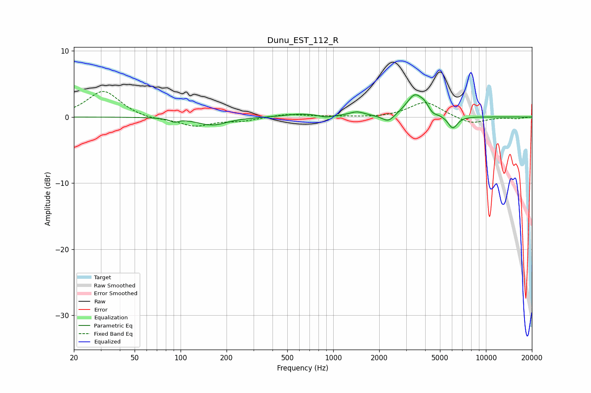

# Dunu_EST_112_R
See [usage instructions](https://github.com/jaakkopasanen/AutoEq#usage) for more options and info.

### Parametric EQs
Apply preamp of -3.5 dB when using parametric equalizer.

|   # | Type    |   Fc (Hz) |    Q |   Gain (dB) |
|-----|---------|-----------|------|-------------|
|   1 | Peaking |        91 | 5.29 |        -0.5 |
|   2 | Peaking |       161 | 1.46 |        -1.2 |
|   3 | Peaking |       615 | 1.33 |         0.5 |
|   4 | Peaking |       895 | 3.76 |        -0.3 |
|   5 | Peaking |      1430 | 2.79 |         0.7 |
|   6 | Peaking |      2297 | 3.55 |        -1.2 |
|   7 | Peaking |      3436 | 2.51 |         3.4 |
|   8 | Peaking |      3973 | 6    |         0.6 |
|   9 | Peaking |      4498 | 6    |        -0.4 |
|  10 | Peaking |      6060 | 4.35 |        -1.9 |

### Fixed Band EQs
When using fixed band (also called graphic) equalizer, apply preamp of **-4.0 dB** (if available) and set gains manually with these parameters.

|   # | Type    |   Fc (Hz) |    Q |   Gain (dB) |
|-----|---------|-----------|------|-------------|
|   1 | Peaking |        31 | 1.41 |         4   |
|   2 | Peaking |        62 | 1.41 |        -0.4 |
|   3 | Peaking |       125 | 1.41 |        -1.4 |
|   4 | Peaking |       250 | 1.41 |        -0.5 |
|   5 | Peaking |       500 | 1.41 |         0.5 |
|   6 | Peaking |      1000 | 1.41 |         0.1 |
|   7 | Peaking |      2000 | 1.41 |        -0.1 |
|   8 | Peaking |      4000 | 1.41 |         2.3 |
|   9 | Peaking |      8000 | 1.41 |        -1.1 |
|  10 | Peaking |     16000 | 1.41 |        -0.2 |

### Graphs

