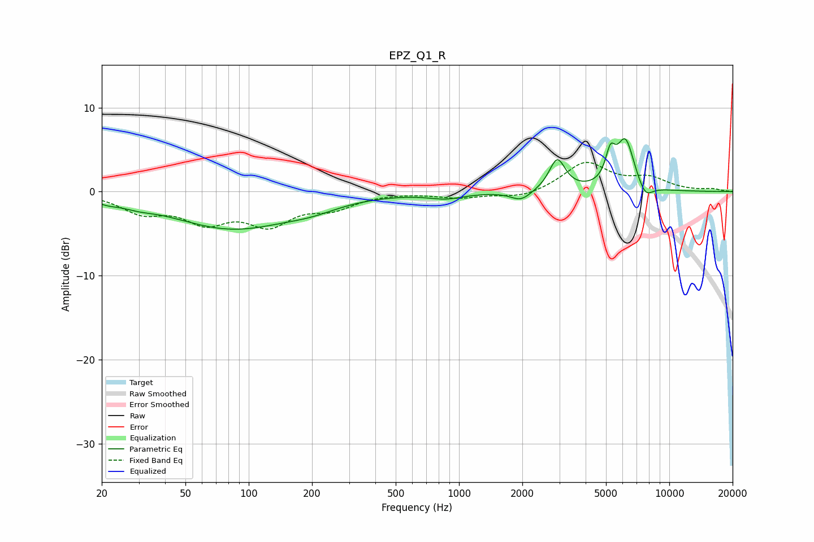

# EPZ_Q1_R
See [usage instructions](https://github.com/jaakkopasanen/AutoEq#usage) for more options and info.

### Parametric EQs
Apply preamp of -6.4 dB when using parametric equalizer.

|   # | Type    |   Fc (Hz) |    Q |   Gain (dB) |
|-----|---------|-----------|------|-------------|
|   1 | Peaking |        21 | 2.89 |        -0.4 |
|   2 | Peaking |        29 | 1.87 |        -0.5 |
|   3 | Peaking |        83 | 0.49 |        -4.3 |
|   4 | Peaking |       200 | 1.1  |        -0.8 |
|   5 | Peaking |       870 | 1.65 |        -0.7 |
|   6 | Peaking |      1972 | 2.9  |        -1.2 |
|   7 | Peaking |      2931 | 3.67 |         3.8 |
|   8 | Peaking |      5247 | 6    |         3.2 |
|   9 | Peaking |      6188 | 3.24 |         6   |
|  10 | Peaking |      7687 | 3.79 |        -1.7 |

### Fixed Band EQs
When using fixed band (also called graphic) equalizer, apply preamp of **-3.6 dB** (if available) and set gains manually with these parameters.

|   # | Type    |   Fc (Hz) |    Q |   Gain (dB) |
|-----|---------|-----------|------|-------------|
|   1 | Peaking |        31 | 1.41 |        -2.2 |
|   2 | Peaking |        62 | 1.41 |        -3.1 |
|   3 | Peaking |       125 | 1.41 |        -3.5 |
|   4 | Peaking |       250 | 1.41 |        -1.7 |
|   5 | Peaking |       500 | 1.41 |        -0   |
|   6 | Peaking |      1000 | 1.41 |        -0.7 |
|   7 | Peaking |      2000 | 1.41 |        -0.8 |
|   8 | Peaking |      4000 | 1.41 |         3.4 |
|   9 | Peaking |      8000 | 1.41 |         1.4 |
|  10 | Peaking |     16000 | 1.41 |         0.3 |

### Graphs

