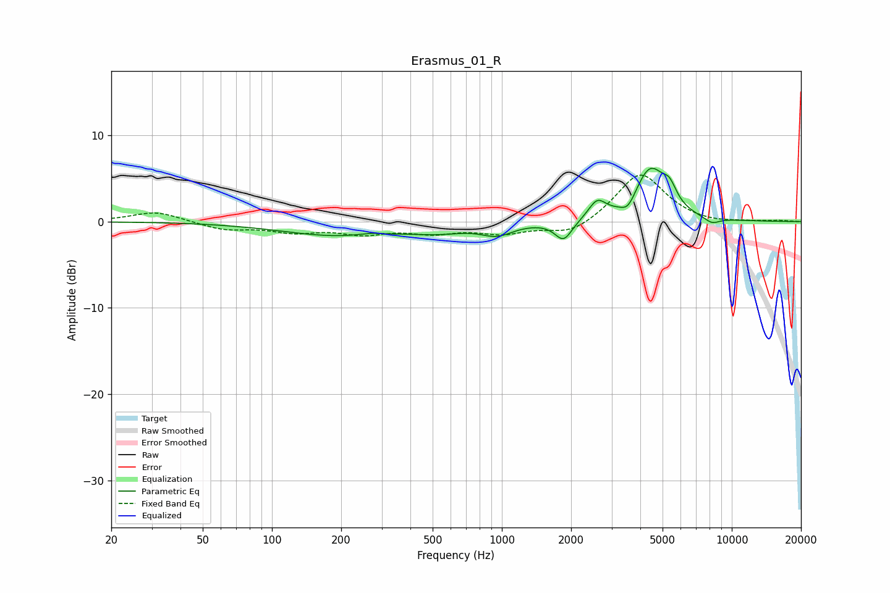

# Erasmus_01_R
See [usage instructions](https://github.com/jaakkopasanen/AutoEq#usage) for more options and info.

### Parametric EQs
Apply preamp of -6.3 dB when using parametric equalizer.

|   # | Type    |   Fc (Hz) |    Q |   Gain (dB) |
|-----|---------|-----------|------|-------------|
|   1 | Peaking |       194 | 0.56 |        -1.6 |
|   2 | Peaking |       267 | 2.56 |         0.3 |
|   3 | Peaking |       532 | 1.1  |        -0.8 |
|   4 | Peaking |       954 | 2.09 |        -1.3 |
|   5 | Peaking |      1855 | 3.75 |        -2.3 |
|   6 | Peaking |      2597 | 3.78 |         2   |
|   7 | Peaking |      3539 | 4.42 |        -1.4 |
|   8 | Peaking |      4414 | 2.06 |         6   |
|   9 | Peaking |      5365 | 4.61 |         1.8 |
|  10 | Peaking |      8182 | 3.82 |        -0.7 |

### Fixed Band EQs
When using fixed band (also called graphic) equalizer, apply preamp of **-5.5 dB** (if available) and set gains manually with these parameters.

|   # | Type    |   Fc (Hz) |    Q |   Gain (dB) |
|-----|---------|-----------|------|-------------|
|   1 | Peaking |        31 | 1.41 |         1.2 |
|   2 | Peaking |        62 | 1.41 |        -0.9 |
|   3 | Peaking |       125 | 1.41 |        -1   |
|   4 | Peaking |       250 | 1.41 |        -1.2 |
|   5 | Peaking |       500 | 1.41 |        -1.1 |
|   6 | Peaking |      1000 | 1.41 |        -1.2 |
|   7 | Peaking |      2000 | 1.41 |        -1.6 |
|   8 | Peaking |      4000 | 1.41 |         5.8 |
|   9 | Peaking |      8000 | 1.41 |        -0.3 |
|  10 | Peaking |     16000 | 1.41 |         0.1 |

### Graphs

