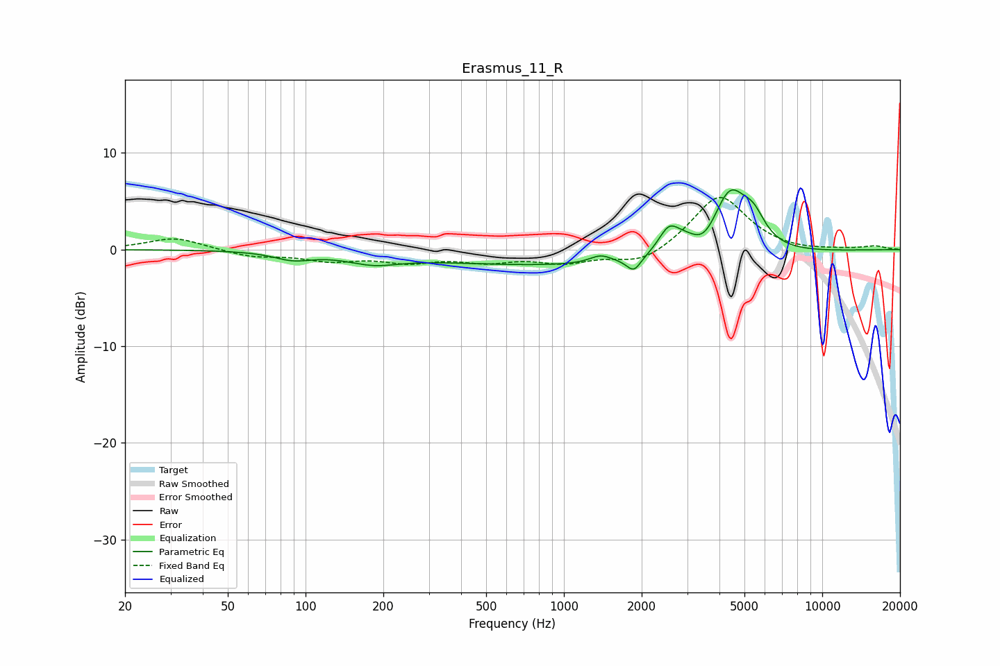

# Erasmus_11_R
See [usage instructions](https://github.com/jaakkopasanen/AutoEq#usage) for more options and info.

### Parametric EQs
Apply preamp of -6.3 dB when using parametric equalizer.

|   # | Type    |   Fc (Hz) |    Q |   Gain (dB) |
|-----|---------|-----------|------|-------------|
|   1 | Peaking |        89 | 1.96 |        -0.8 |
|   2 | Peaking |       183 | 1.39 |        -1   |
|   3 | Peaking |      1283 | 0.2  |        -1.7 |
|   4 | Peaking |      1387 | 3.26 |         0.8 |
|   5 | Peaking |      1865 | 5.17 |        -1.4 |
|   6 | Peaking |      2544 | 3.51 |         2.5 |
|   7 | Peaking |      2943 | 2.46 |         1.1 |
|   8 | Peaking |      3497 | 2.92 |        -1.3 |
|   9 | Peaking |      4387 | 2.05 |         6.6 |
|  10 | Peaking |      5419 | 3.05 |         2.4 |

### Fixed Band EQs
When using fixed band (also called graphic) equalizer, apply preamp of **-5.5 dB** (if available) and set gains manually with these parameters.

|   # | Type    |   Fc (Hz) |    Q |   Gain (dB) |
|-----|---------|-----------|------|-------------|
|   1 | Peaking |        31 | 1.41 |         1.3 |
|   2 | Peaking |        62 | 1.41 |        -0.7 |
|   3 | Peaking |       125 | 1.41 |        -1   |
|   4 | Peaking |       250 | 1.41 |        -1.1 |
|   5 | Peaking |       500 | 1.41 |        -1   |
|   6 | Peaking |      1000 | 1.41 |        -1.2 |
|   7 | Peaking |      2000 | 1.41 |        -1.6 |
|   8 | Peaking |      4000 | 1.41 |         5.7 |
|   9 | Peaking |      8000 | 1.41 |        -0.2 |
|  10 | Peaking |     16000 | 1.41 |         0.3 |

### Graphs

