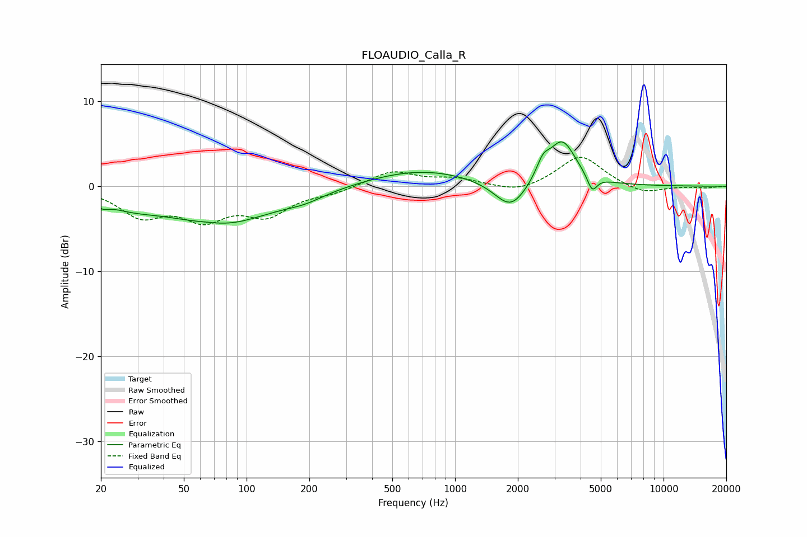

# FLOAUDIO_Calla_R
See [usage instructions](https://github.com/jaakkopasanen/AutoEq#usage) for more options and info.

### Parametric EQs
Apply preamp of -5.3 dB when using parametric equalizer.

|   # | Type    |   Fc (Hz) |    Q |   Gain (dB) |
|-----|---------|-----------|------|-------------|
|   1 | Peaking |        20 | 4.83 |        -0.7 |
|   2 | Peaking |        27 | 0.96 |        -1.5 |
|   3 | Peaking |        65 | 1.9  |         0.2 |
|   4 | Peaking |        76 | 0.57 |        -4.3 |
|   5 | Peaking |       190 | 1.45 |        -0.7 |
|   6 | Peaking |       684 | 0.56 |         2   |
|   7 | Peaking |      1850 | 1.83 |        -3.4 |
|   8 | Peaking |      2636 | 4.5  |         1.8 |
|   9 | Peaking |      3262 | 2.11 |         5.3 |
|  10 | Peaking |      4545 | 6    |        -1.9 |

### Fixed Band EQs
When using fixed band (also called graphic) equalizer, apply preamp of **-3.5 dB** (if available) and set gains manually with these parameters.

|   # | Type    |   Fc (Hz) |    Q |   Gain (dB) |
|-----|---------|-----------|------|-------------|
|   1 | Peaking |        31 | 1.41 |        -3.2 |
|   2 | Peaking |        62 | 1.41 |        -3.4 |
|   3 | Peaking |       125 | 1.41 |        -3   |
|   4 | Peaking |       250 | 1.41 |        -0.7 |
|   5 | Peaking |       500 | 1.41 |         1.8 |
|   6 | Peaking |      1000 | 1.41 |         0.8 |
|   7 | Peaking |      2000 | 1.41 |        -0.9 |
|   8 | Peaking |      4000 | 1.41 |         3.7 |
|   9 | Peaking |      8000 | 1.41 |        -1   |
|  10 | Peaking |     16000 | 1.41 |        -0.2 |

### Graphs

