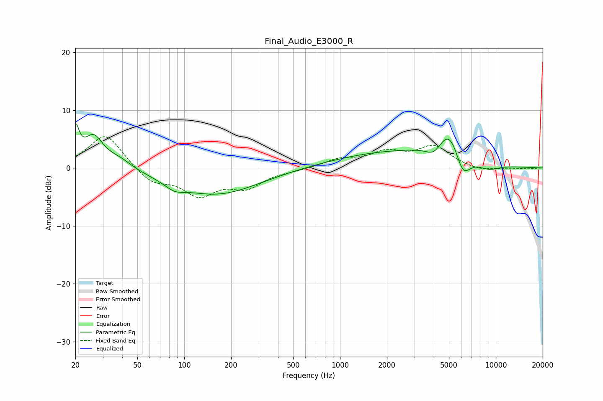

# Final_Audio_E3000_R
See [usage instructions](https://github.com/jaakkopasanen/AutoEq#usage) for more options and info.

### Parametric EQs
Apply preamp of -7.8 dB when using parametric equalizer.

|   # | Type    |   Fc (Hz) |    Q |   Gain (dB) |
|-----|---------|-----------|------|-------------|
|   1 | Peaking |        20 | 6    |         5.6 |
|   2 | Peaking |        26 | 2.25 |         5.2 |
|   3 | Peaking |        38 | 1.73 |         1.5 |
|   4 | Peaking |        87 | 2.23 |        -1.3 |
|   5 | Peaking |       161 | 0.52 |        -4.6 |
|   6 | Peaking |      2343 | 0.34 |         2.8 |
|   7 | Peaking |      4011 | 2.79 |        -1.9 |
|   8 | Peaking |      5086 | 1.74 |         5.7 |
|   9 | Peaking |      6120 | 2.67 |        -5   |
|  10 | Peaking |      8945 | 1.71 |        -1.2 |

### Fixed Band EQs
When using fixed band (also called graphic) equalizer, apply preamp of **-5.5 dB** (if available) and set gains manually with these parameters.

|   # | Type    |   Fc (Hz) |    Q |   Gain (dB) |
|-----|---------|-----------|------|-------------|
|   1 | Peaking |        31 | 1.41 |         6   |
|   2 | Peaking |        62 | 1.41 |        -2.6 |
|   3 | Peaking |       125 | 1.41 |        -4.3 |
|   4 | Peaking |       250 | 1.41 |        -3   |
|   5 | Peaking |       500 | 1.41 |        -0.3 |
|   6 | Peaking |      1000 | 1.41 |         1.4 |
|   7 | Peaking |      2000 | 1.41 |         2.4 |
|   8 | Peaking |      4000 | 1.41 |         3.5 |
|   9 | Peaking |      8000 | 1.41 |        -0.6 |
|  10 | Peaking |     16000 | 1.41 |        -0.2 |

### Graphs

