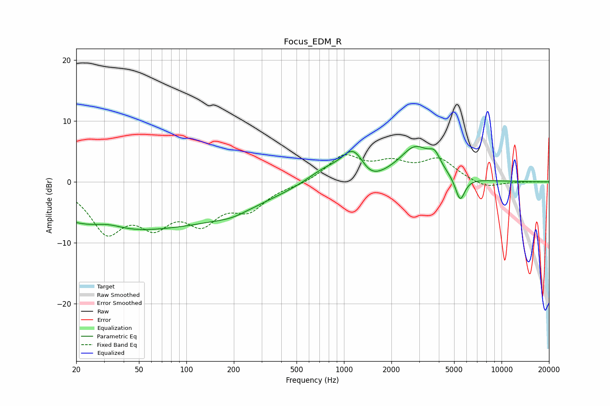

# Focus_EDM_R
See [usage instructions](https://github.com/jaakkopasanen/AutoEq#usage) for more options and info.

### Parametric EQs
Apply preamp of -5.9 dB when using parametric equalizer.

|   # | Type    |   Fc (Hz) |    Q |   Gain (dB) |
|-----|---------|-----------|------|-------------|
|   1 | Peaking |        28 | 0.37 |        -6.8 |
|   2 | Peaking |        32 | 1.48 |         1.1 |
|   3 | Peaking |       136 | 0.37 |        -4.7 |
|   4 | Peaking |       196 | 1.44 |        -0.7 |
|   5 | Peaking |       743 | 1.23 |         2   |
|   6 | Peaking |      1150 | 1.85 |         5.1 |
|   7 | Peaking |      1452 | 1.81 |        -2   |
|   8 | Peaking |      2845 | 1.38 |         5.5 |
|   9 | Peaking |      3771 | 3.92 |         2.2 |
|  10 | Peaking |      5460 | 4.54 |        -4   |

### Fixed Band EQs
When using fixed band (also called graphic) equalizer, apply preamp of **-4.6 dB** (if available) and set gains manually with these parameters.

|   # | Type    |   Fc (Hz) |    Q |   Gain (dB) |
|-----|---------|-----------|------|-------------|
|   1 | Peaking |        31 | 1.41 |        -7.6 |
|   2 | Peaking |        62 | 1.41 |        -5.7 |
|   3 | Peaking |       125 | 1.41 |        -5.6 |
|   4 | Peaking |       250 | 1.41 |        -3.9 |
|   5 | Peaking |       500 | 1.41 |        -0.5 |
|   6 | Peaking |      1000 | 1.41 |         4.1 |
|   7 | Peaking |      2000 | 1.41 |         2.6 |
|   8 | Peaking |      4000 | 1.41 |         3.5 |
|   9 | Peaking |      8000 | 1.41 |        -1.1 |
|  10 | Peaking |     16000 | 1.41 |         0   |

### Graphs

