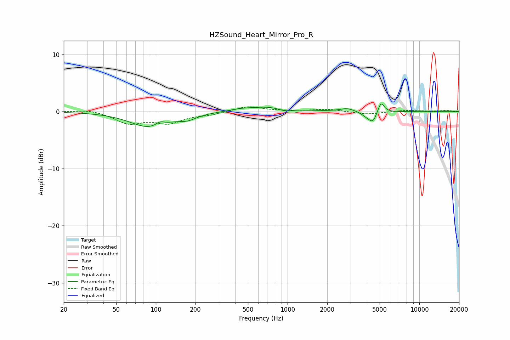

# HZSound_Heart_Mirror_Pro_R
See [usage instructions](https://github.com/jaakkopasanen/AutoEq#usage) for more options and info.

### Parametric EQs
Apply preamp of -1.4 dB when using parametric equalizer.

|   # | Type    |   Fc (Hz) |    Q |   Gain (dB) |
|-----|---------|-----------|------|-------------|
|   1 | Peaking |        90 | 0.96 |        -2.7 |
|   2 | Peaking |       108 | 4.1  |         0.7 |
|   3 | Peaking |       175 | 2.16 |        -0.8 |
|   4 | Peaking |       445 | 1.64 |         0.3 |
|   5 | Peaking |       767 | 0.95 |         1   |
|   6 | Peaking |       950 | 2.34 |        -0.7 |
|   7 | Peaking |      2827 | 2.75 |         0.6 |
|   8 | Peaking |      3968 | 3.95 |        -0.7 |
|   9 | Peaking |      4437 | 4.84 |        -1.7 |
|  10 | Peaking |      5119 | 6    |         1.9 |

### Fixed Band EQs
When using fixed band (also called graphic) equalizer, apply preamp of **-0.9 dB** (if available) and set gains manually with these parameters.

|   # | Type    |   Fc (Hz) |    Q |   Gain (dB) |
|-----|---------|-----------|------|-------------|
|   1 | Peaking |        31 | 1.41 |         0.4 |
|   2 | Peaking |        62 | 1.41 |        -2   |
|   3 | Peaking |       125 | 1.41 |        -1.8 |
|   4 | Peaking |       250 | 1.41 |        -0.5 |
|   5 | Peaking |       500 | 1.41 |         1   |
|   6 | Peaking |      1000 | 1.41 |         0.1 |
|   7 | Peaking |      2000 | 1.41 |         0.4 |
|   8 | Peaking |      4000 | 1.41 |        -0.5 |
|   9 | Peaking |      8000 | 1.41 |         0.2 |
|  10 | Peaking |     16000 | 1.41 |         0.2 |

### Graphs

