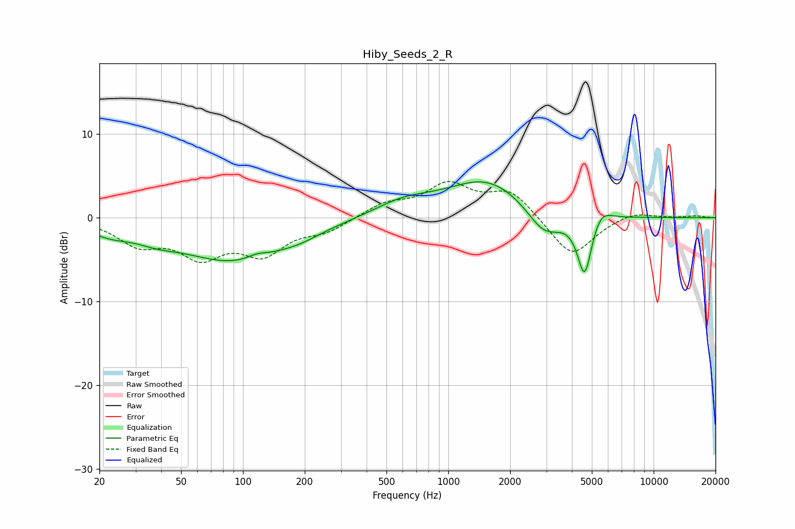

# Hiby_Seeds_2_R
See [usage instructions](https://github.com/jaakkopasanen/AutoEq#usage) for more options and info.

### Parametric EQs
Apply preamp of -4.4 dB when using parametric equalizer.

|   # | Type    |   Fc (Hz) |    Q |   Gain (dB) |
|-----|---------|-----------|------|-------------|
|   1 | Peaking |        22 | 1.4  |        -1.2 |
|   2 | Peaking |        38 | 1.37 |        -1   |
|   3 | Peaking |        90 | 0.54 |        -5   |
|   4 | Peaking |       117 | 3.14 |         0.5 |
|   5 | Peaking |       189 | 1.39 |        -0.7 |
|   6 | Peaking |       604 | 0.98 |         1.6 |
|   7 | Peaking |      1550 | 0.72 |         4.5 |
|   8 | Peaking |      2932 | 1.65 |        -3.4 |
|   9 | Peaking |      4610 | 3.96 |        -7.2 |
|  10 | Peaking |      5523 | 2.88 |         1.7 |

### Fixed Band EQs
When using fixed band (also called graphic) equalizer, apply preamp of **-4.4 dB** (if available) and set gains manually with these parameters.

|   # | Type    |   Fc (Hz) |    Q |   Gain (dB) |
|-----|---------|-----------|------|-------------|
|   1 | Peaking |        31 | 1.41 |        -2.9 |
|   2 | Peaking |        62 | 1.41 |        -4.1 |
|   3 | Peaking |       125 | 1.41 |        -3.9 |
|   4 | Peaking |       250 | 1.41 |        -1.4 |
|   5 | Peaking |       500 | 1.41 |         1.6 |
|   6 | Peaking |      1000 | 1.41 |         3.7 |
|   7 | Peaking |      2000 | 1.41 |         3.1 |
|   8 | Peaking |      4000 | 1.41 |        -4.8 |
|   9 | Peaking |      8000 | 1.41 |         0.8 |
|  10 | Peaking |     16000 | 1.41 |         0.2 |

### Graphs

