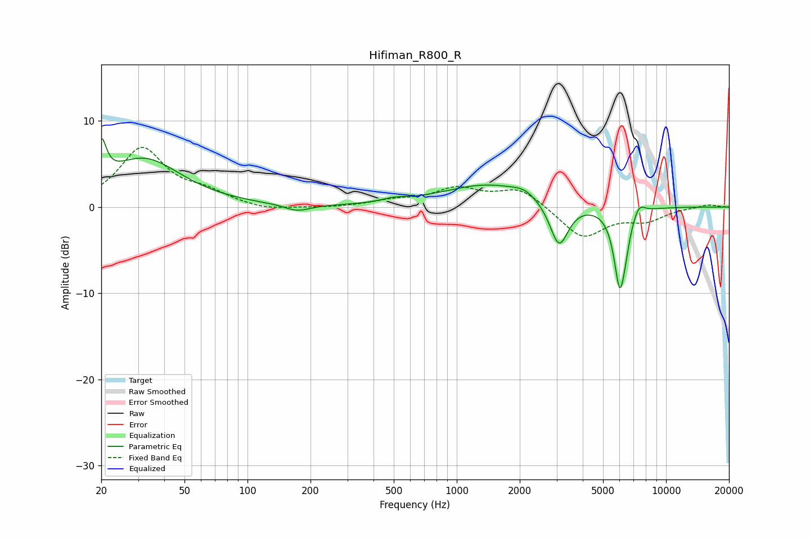

# Hifiman_R800_R
See [usage instructions](https://github.com/jaakkopasanen/AutoEq#usage) for more options and info.

### Parametric EQs
Apply preamp of -8.1 dB when using parametric equalizer.

|   # | Type    |   Fc (Hz) |    Q |   Gain (dB) |
|-----|---------|-----------|------|-------------|
|   1 | Peaking |        20 | 6    |         4.5 |
|   2 | Peaking |        32 | 0.79 |         5.5 |
|   3 | Peaking |       173 | 2.35 |        -0.8 |
|   4 | Peaking |       503 | 2.4  |         0.4 |
|   5 | Peaking |      1431 | 0.64 |         2.6 |
|   6 | Peaking |      2108 | 2.67 |         0.6 |
|   7 | Peaking |      3082 | 3.17 |        -5.3 |
|   8 | Peaking |      6015 | 4.88 |        -9   |
|   9 | Peaking |      6392 | 6    |        -1.3 |
|  10 | Peaking |      7424 | 4.86 |         1.4 |

### Fixed Band EQs
When using fixed band (also called graphic) equalizer, apply preamp of **-7.0 dB** (if available) and set gains manually with these parameters.

|   # | Type    |   Fc (Hz) |    Q |   Gain (dB) |
|-----|---------|-----------|------|-------------|
|   1 | Peaking |        31 | 1.41 |         6.7 |
|   2 | Peaking |        62 | 1.41 |         1.4 |
|   3 | Peaking |       125 | 1.41 |        -0.5 |
|   4 | Peaking |       250 | 1.41 |        -0.1 |
|   5 | Peaking |       500 | 1.41 |         0.6 |
|   6 | Peaking |      1000 | 1.41 |         2   |
|   7 | Peaking |      2000 | 1.41 |         2.2 |
|   8 | Peaking |      4000 | 1.41 |        -3.6 |
|   9 | Peaking |      8000 | 1.41 |        -1.4 |
|  10 | Peaking |     16000 | 1.41 |         0.3 |

### Graphs

