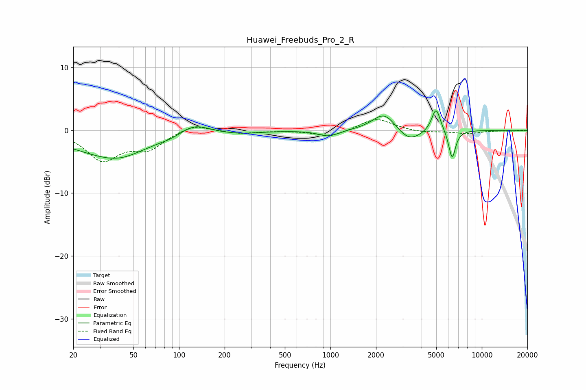

# Huawei_Freebuds_Pro_2_R
See [usage instructions](https://github.com/jaakkopasanen/AutoEq#usage) for more options and info.

### Parametric EQs
Apply preamp of -3.2 dB when using parametric equalizer.

|   # | Type    |   Fc (Hz) |    Q |   Gain (dB) |
|-----|---------|-----------|------|-------------|
|   1 | Peaking |        33 | 0.5  |        -3.3 |
|   2 | Peaking |        41 | 1.01 |        -1.3 |
|   3 | Peaking |        87 | 2.28 |        -0.3 |
|   4 | Peaking |       126 | 1.51 |         1.7 |
|   5 | Peaking |       256 | 1.08 |        -0.4 |
|   6 | Peaking |       972 | 2.1  |        -1   |
|   7 | Peaking |      2270 | 1.82 |         3   |
|   8 | Peaking |      3298 | 1.78 |        -2.1 |
|   9 | Peaking |      4986 | 4.77 |         3.9 |
|  10 | Peaking |      6366 | 6    |        -4.6 |

### Fixed Band EQs
When using fixed band (also called graphic) equalizer, apply preamp of **-1.8 dB** (if available) and set gains manually with these parameters.

|   # | Type    |   Fc (Hz) |    Q |   Gain (dB) |
|-----|---------|-----------|------|-------------|
|   1 | Peaking |        31 | 1.41 |        -4.6 |
|   2 | Peaking |        62 | 1.41 |        -2.7 |
|   3 | Peaking |       125 | 1.41 |         1.1 |
|   4 | Peaking |       250 | 1.41 |        -0.5 |
|   5 | Peaking |       500 | 1.41 |        -0   |
|   6 | Peaking |      1000 | 1.41 |        -1.1 |
|   7 | Peaking |      2000 | 1.41 |         2   |
|   8 | Peaking |      4000 | 1.41 |        -0.4 |
|   9 | Peaking |      8000 | 1.41 |        -0.5 |
|  10 | Peaking |     16000 | 1.41 |        -0.1 |

### Graphs

