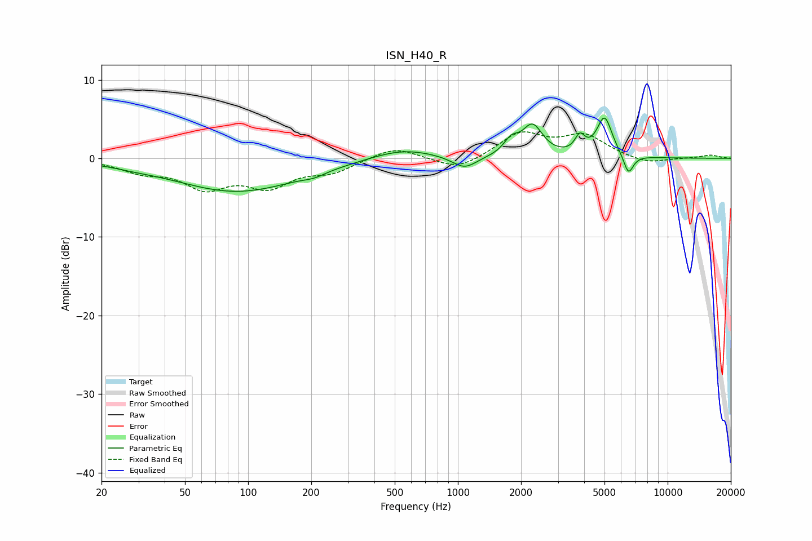

# ISN_H40_R
See [usage instructions](https://github.com/jaakkopasanen/AutoEq#usage) for more options and info.

### Parametric EQs
Apply preamp of -5.2 dB when using parametric equalizer.

|   # | Type    |   Fc (Hz) |    Q |   Gain (dB) |
|-----|---------|-----------|------|-------------|
|   1 | Peaking |        28 | 1.48 |        -0.2 |
|   2 | Peaking |        89 | 0.47 |        -4.2 |
|   3 | Peaking |       206 | 2.82 |        -0.4 |
|   4 | Peaking |       542 | 0.92 |         1.4 |
|   5 | Peaking |      1076 | 2.38 |        -1.6 |
|   6 | Peaking |      1796 | 3.98 |         1.7 |
|   7 | Peaking |      2268 | 2.94 |         3.9 |
|   8 | Peaking |      3817 | 6    |         2.1 |
|   9 | Peaking |      5001 | 3.81 |         5   |
|  10 | Peaking |      6503 | 5.86 |        -2.6 |

### Fixed Band EQs
When using fixed band (also called graphic) equalizer, apply preamp of **-3.5 dB** (if available) and set gains manually with these parameters.

|   # | Type    |   Fc (Hz) |    Q |   Gain (dB) |
|-----|---------|-----------|------|-------------|
|   1 | Peaking |        31 | 1.41 |        -1.5 |
|   2 | Peaking |        62 | 1.41 |        -3.4 |
|   3 | Peaking |       125 | 1.41 |        -3.2 |
|   4 | Peaking |       250 | 1.41 |        -1.5 |
|   5 | Peaking |       500 | 1.41 |         1.5 |
|   6 | Peaking |      1000 | 1.41 |        -1.6 |
|   7 | Peaking |      2000 | 1.41 |         3.1 |
|   8 | Peaking |      4000 | 1.41 |         2.7 |
|   9 | Peaking |      8000 | 1.41 |        -0.8 |
|  10 | Peaking |     16000 | 1.41 |         0.4 |

### Graphs

