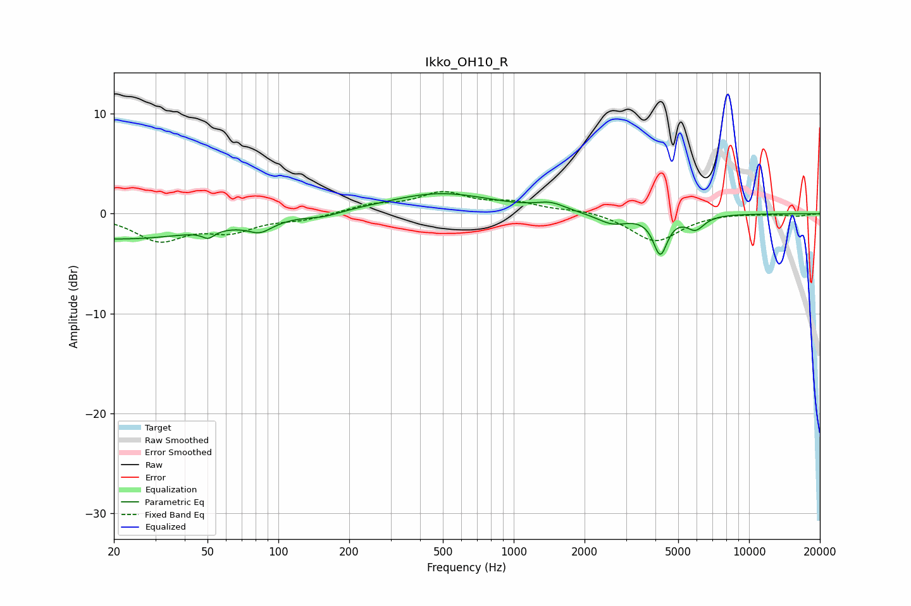

# Ikko_OH10_R
See [usage instructions](https://github.com/jaakkopasanen/AutoEq#usage) for more options and info.

### Parametric EQs
Apply preamp of -2.1 dB when using parametric equalizer.

|   # | Type    |   Fc (Hz) |    Q |   Gain (dB) |
|-----|---------|-----------|------|-------------|
|   1 | Peaking |        21 | 0.35 |        -2.5 |
|   2 | Peaking |        50 | 6    |         1.5 |
|   3 | Peaking |        50 | 5.84 |        -2.2 |
|   4 | Peaking |        84 | 2.75 |        -1.1 |
|   5 | Peaking |       156 | 2.07 |        -0.4 |
|   6 | Peaking |       486 | 0.62 |         2   |
|   7 | Peaking |      1435 | 2.27 |         0.7 |
|   8 | Peaking |      2630 | 2.04 |        -1.1 |
|   9 | Peaking |      4196 | 4.73 |        -3.8 |
|  10 | Peaking |      5926 | 3.67 |        -1.4 |

### Fixed Band EQs
When using fixed band (also called graphic) equalizer, apply preamp of **-2.3 dB** (if available) and set gains manually with these parameters.

|   # | Type    |   Fc (Hz) |    Q |   Gain (dB) |
|-----|---------|-----------|------|-------------|
|   1 | Peaking |        31 | 1.41 |        -2.6 |
|   2 | Peaking |        62 | 1.41 |        -1.6 |
|   3 | Peaking |       125 | 1.41 |        -0.5 |
|   4 | Peaking |       250 | 1.41 |         0.8 |
|   5 | Peaking |       500 | 1.41 |         1.9 |
|   6 | Peaking |      1000 | 1.41 |         1   |
|   7 | Peaking |      2000 | 1.41 |         0.4 |
|   8 | Peaking |      4000 | 1.41 |        -2.8 |
|   9 | Peaking |      8000 | 1.41 |         0.1 |
|  10 | Peaking |     16000 | 1.41 |        -0.2 |

### Graphs

