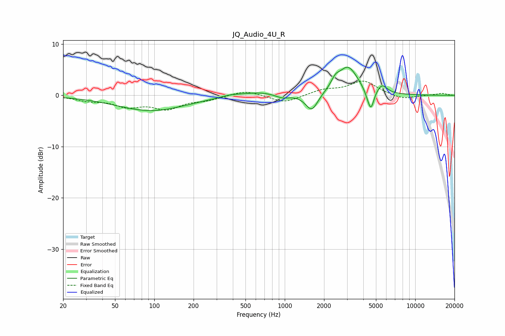

# JQ_Audio_4U_R
See [usage instructions](https://github.com/jaakkopasanen/AutoEq#usage) for more options and info.

### Parametric EQs
Apply preamp of -5.6 dB when using parametric equalizer.

|   # | Type    |   Fc (Hz) |    Q |   Gain (dB) |
|-----|---------|-----------|------|-------------|
|   1 | Peaking |        95 | 0.53 |        -3   |
|   2 | Peaking |       388 | 1.91 |         0.4 |
|   3 | Peaking |       635 | 1.13 |         0.7 |
|   4 | Peaking |       957 | 2.69 |        -0.7 |
|   5 | Peaking |      1611 | 2.97 |        -3.4 |
|   6 | Peaking |      2439 | 4.47 |         1.4 |
|   7 | Peaking |      3048 | 1.84 |         5.5 |
|   8 | Peaking |      4327 | 4.73 |        -0.9 |
|   9 | Peaking |      4578 | 5.96 |        -3.6 |
|  10 | Peaking |      5575 | 3.71 |         1.7 |

### Fixed Band EQs
When using fixed band (also called graphic) equalizer, apply preamp of **-2.9 dB** (if available) and set gains manually with these parameters.

|   # | Type    |   Fc (Hz) |    Q |   Gain (dB) |
|-----|---------|-----------|------|-------------|
|   1 | Peaking |        31 | 1.41 |        -0.9 |
|   2 | Peaking |        62 | 1.41 |        -1.9 |
|   3 | Peaking |       125 | 1.41 |        -2.4 |
|   4 | Peaking |       250 | 1.41 |        -0.8 |
|   5 | Peaking |       500 | 1.41 |         1   |
|   6 | Peaking |      1000 | 1.41 |        -1.5 |
|   7 | Peaking |      2000 | 1.41 |         1   |
|   8 | Peaking |      4000 | 1.41 |         2.8 |
|   9 | Peaking |      8000 | 1.41 |        -0.8 |
|  10 | Peaking |     16000 | 1.41 |         0.4 |

### Graphs

