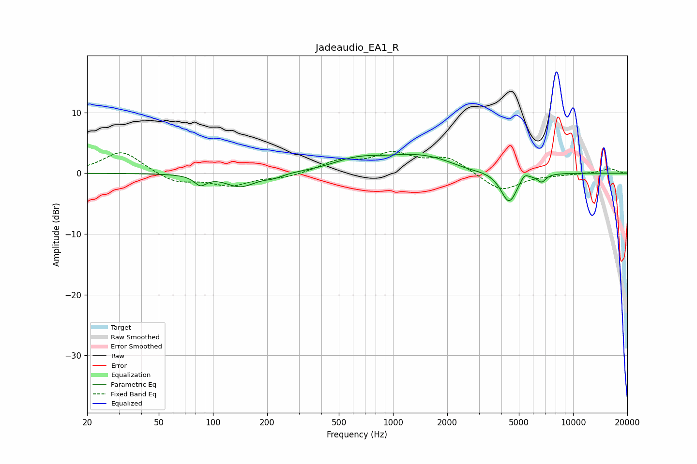

# Jadeaudio_EA1_R
See [usage instructions](https://github.com/jaakkopasanen/AutoEq#usage) for more options and info.

### Parametric EQs
Apply preamp of -3.2 dB when using parametric equalizer.

|   # | Type    |   Fc (Hz) |    Q |   Gain (dB) |
|-----|---------|-----------|------|-------------|
|   1 | Peaking |        85 | 4.26 |        -1.6 |
|   2 | Peaking |       142 | 1.68 |        -2.2 |
|   3 | Peaking |       217 | 2.89 |        -0.5 |
|   4 | Peaking |       594 | 1.26 |         1.2 |
|   5 | Peaking |       755 | 2.61 |         0.2 |
|   6 | Peaking |      1408 | 0.58 |         3.1 |
|   7 | Peaking |      2530 | 1.32 |        -0.8 |
|   8 | Peaking |      4409 | 3.04 |        -5.2 |
|   9 | Peaking |      5361 | 6    |         1.1 |
|  10 | Peaking |      6691 | 5.81 |        -1.3 |

### Fixed Band EQs
When using fixed band (also called graphic) equalizer, apply preamp of **-3.7 dB** (if available) and set gains manually with these parameters.

|   # | Type    |   Fc (Hz) |    Q |   Gain (dB) |
|-----|---------|-----------|------|-------------|
|   1 | Peaking |        31 | 1.41 |         3.7 |
|   2 | Peaking |        62 | 1.41 |        -1.6 |
|   3 | Peaking |       125 | 1.41 |        -1.9 |
|   4 | Peaking |       250 | 1.41 |        -0.7 |
|   5 | Peaking |       500 | 1.41 |         1.8 |
|   6 | Peaking |      1000 | 1.41 |         2.9 |
|   7 | Peaking |      2000 | 1.41 |         2.5 |
|   8 | Peaking |      4000 | 1.41 |        -3   |
|   9 | Peaking |      8000 | 1.41 |        -0.2 |
|  10 | Peaking |     16000 | 1.41 |         0.8 |

### Graphs

