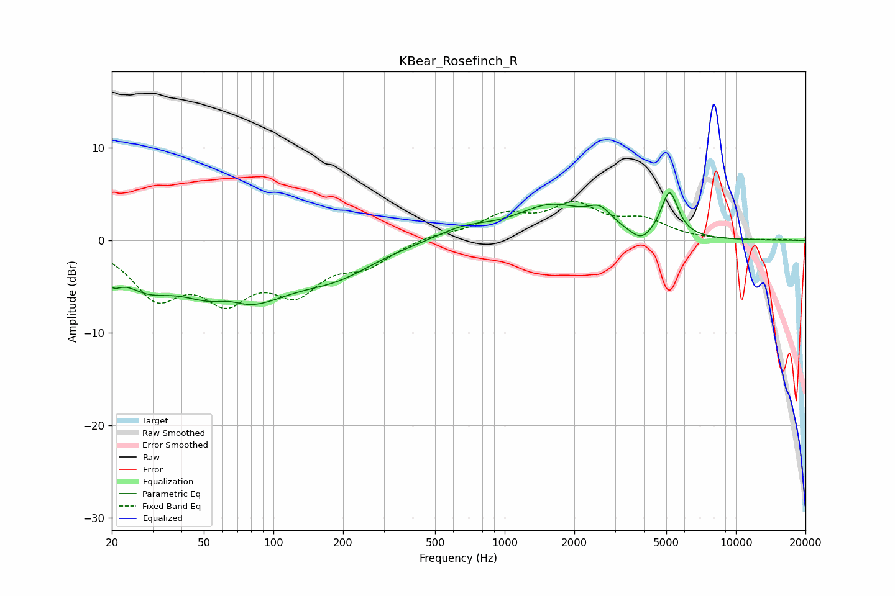

# KBear_Rosefinch_R
See [usage instructions](https://github.com/jaakkopasanen/AutoEq#usage) for more options and info.

### Parametric EQs
Apply preamp of -5.2 dB when using parametric equalizer.

|   # | Type    |   Fc (Hz) |    Q |   Gain (dB) |
|-----|---------|-----------|------|-------------|
|   1 | Peaking |        20 | 3.72 |        -2.1 |
|   2 | Peaking |        28 | 1.4  |        -2.6 |
|   3 | Peaking |        65 | 2.05 |         1.3 |
|   4 | Peaking |        68 | 0.62 |        -7.2 |
|   5 | Peaking |       191 | 0.86 |        -2.3 |
|   6 | Peaking |       664 | 1.18 |         1.2 |
|   7 | Peaking |      1592 | 0.93 |         3.6 |
|   8 | Peaking |      2580 | 2.68 |         1.8 |
|   9 | Peaking |      3903 | 2.98 |        -1.3 |
|  10 | Peaking |      5165 | 3.83 |         5   |

### Fixed Band EQs
When using fixed band (also called graphic) equalizer, apply preamp of **-4.3 dB** (if available) and set gains manually with these parameters.

|   # | Type    |   Fc (Hz) |    Q |   Gain (dB) |
|-----|---------|-----------|------|-------------|
|   1 | Peaking |        31 | 1.41 |        -5.6 |
|   2 | Peaking |        62 | 1.41 |        -5.3 |
|   3 | Peaking |       125 | 1.41 |        -4.8 |
|   4 | Peaking |       250 | 1.41 |        -2.3 |
|   5 | Peaking |       500 | 1.41 |         0.6 |
|   6 | Peaking |      1000 | 1.41 |         2.4 |
|   7 | Peaking |      2000 | 1.41 |         3.4 |
|   8 | Peaking |      4000 | 1.41 |         1.9 |
|   9 | Peaking |      8000 | 1.41 |        -0   |
|  10 | Peaking |     16000 | 1.41 |         0.1 |

### Graphs

