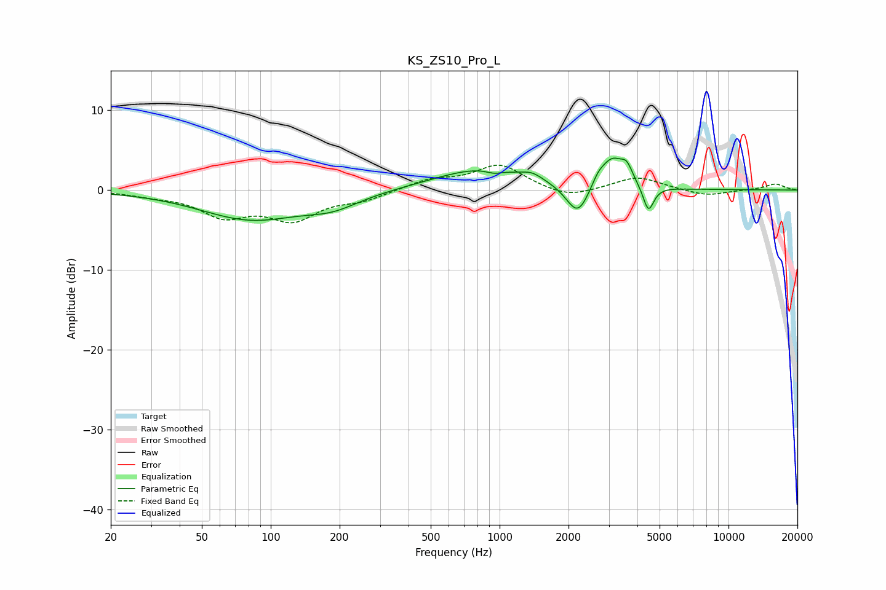

# KS_ZS10_Pro_L
See [usage instructions](https://github.com/jaakkopasanen/AutoEq#usage) for more options and info.

### Parametric EQs
Apply preamp of -4.1 dB when using parametric equalizer.

|   # | Type    |   Fc (Hz) |    Q |   Gain (dB) |
|-----|---------|-----------|------|-------------|
|   1 | Peaking |        82 | 0.64 |        -3.6 |
|   2 | Peaking |       186 | 1.18 |        -1.5 |
|   3 | Peaking |       842 | 0.69 |         2.7 |
|   4 | Peaking |       946 | 3.96 |        -0.5 |
|   5 | Peaking |      1388 | 3.07 |         0.8 |
|   6 | Peaking |      2196 | 2.79 |        -4.2 |
|   7 | Peaking |      2684 | 5.69 |         0.8 |
|   8 | Peaking |      3093 | 2.55 |         3.9 |
|   9 | Peaking |      3595 | 5.76 |         1.7 |
|  10 | Peaking |      4470 | 6    |        -3.3 |

### Fixed Band EQs
When using fixed band (also called graphic) equalizer, apply preamp of **-3.2 dB** (if available) and set gains manually with these parameters.

|   # | Type    |   Fc (Hz) |    Q |   Gain (dB) |
|-----|---------|-----------|------|-------------|
|   1 | Peaking |        31 | 1.41 |        -0.5 |
|   2 | Peaking |        62 | 1.41 |        -3   |
|   3 | Peaking |       125 | 1.41 |        -3.4 |
|   4 | Peaking |       250 | 1.41 |        -1.1 |
|   5 | Peaking |       500 | 1.41 |         1.2 |
|   6 | Peaking |      1000 | 1.41 |         3.1 |
|   7 | Peaking |      2000 | 1.41 |        -1.2 |
|   8 | Peaking |      4000 | 1.41 |         1.7 |
|   9 | Peaking |      8000 | 1.41 |        -0.8 |
|  10 | Peaking |     16000 | 1.41 |         0.8 |

### Graphs

