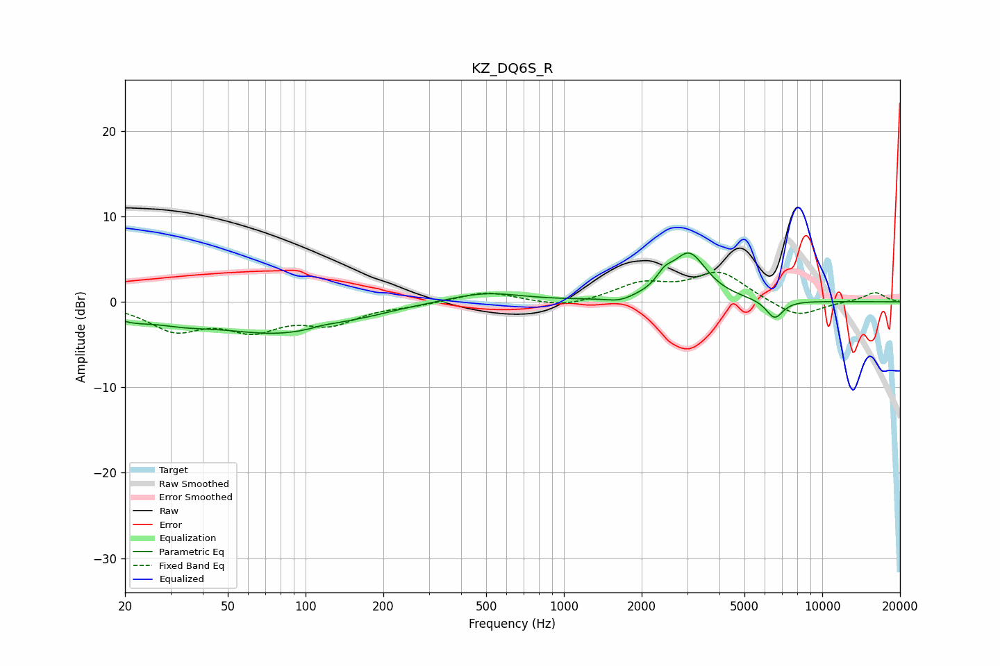

# KZ_DQ6S_R
See [usage instructions](https://github.com/jaakkopasanen/AutoEq#usage) for more options and info.

### Parametric EQs
Apply preamp of -5.8 dB when using parametric equalizer.

|   # | Type    |   Fc (Hz) |    Q |   Gain (dB) |
|-----|---------|-----------|------|-------------|
|   1 | Peaking |        21 | 1.77 |        -1.1 |
|   2 | Peaking |        33 | 1.11 |        -1.2 |
|   3 | Peaking |        80 | 0.57 |        -3.5 |
|   4 | Peaking |       117 | 3.45 |         0.2 |
|   5 | Peaking |       183 | 2    |        -0.2 |
|   6 | Peaking |       492 | 1    |         1.2 |
|   7 | Peaking |      1644 | 2.84 |        -0.5 |
|   8 | Peaking |      2450 | 4.67 |         1.3 |
|   9 | Peaking |      3051 | 2.06 |         5.5 |
|  10 | Peaking |      6540 | 4.11 |        -2.2 |

### Fixed Band EQs
When using fixed band (also called graphic) equalizer, apply preamp of **-3.6 dB** (if available) and set gains manually with these parameters.

|   # | Type    |   Fc (Hz) |    Q |   Gain (dB) |
|-----|---------|-----------|------|-------------|
|   1 | Peaking |        31 | 1.41 |        -3   |
|   2 | Peaking |        62 | 1.41 |        -2.9 |
|   3 | Peaking |       125 | 1.41 |        -2.3 |
|   4 | Peaking |       250 | 1.41 |        -0.3 |
|   5 | Peaking |       500 | 1.41 |         1.2 |
|   6 | Peaking |      1000 | 1.41 |        -0.8 |
|   7 | Peaking |      2000 | 1.41 |         2   |
|   8 | Peaking |      4000 | 1.41 |         3.4 |
|   9 | Peaking |      8000 | 1.41 |        -1.9 |
|  10 | Peaking |     16000 | 1.41 |         1.1 |

### Graphs

