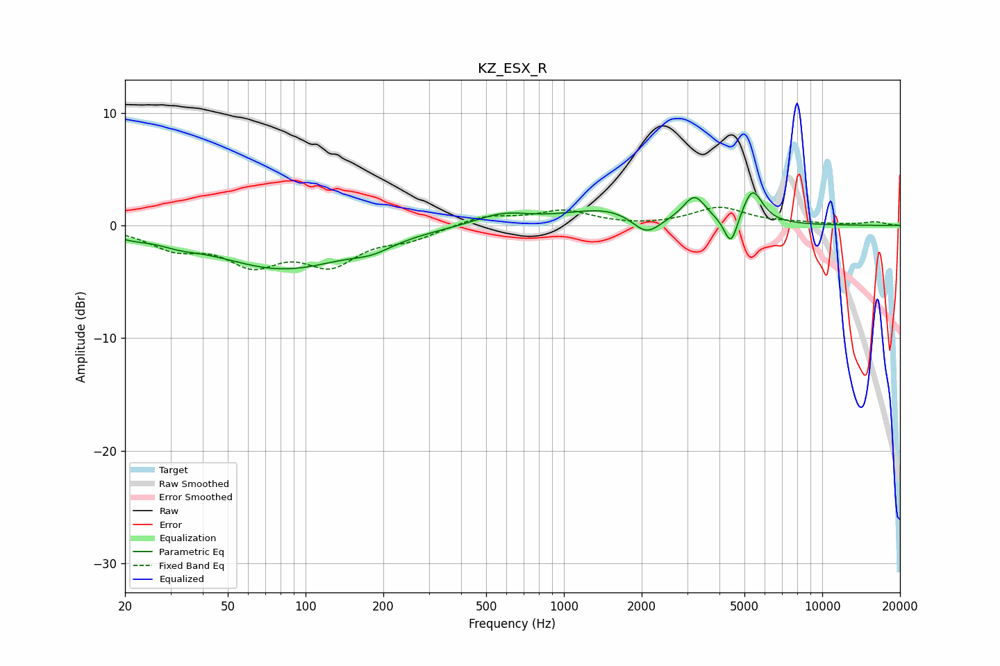

# KZ_ESX_R
See [usage instructions](https://github.com/jaakkopasanen/AutoEq#usage) for more options and info.

### Parametric EQs
Apply preamp of -3.0 dB when using parametric equalizer.

|   # | Type    |   Fc (Hz) |    Q |   Gain (dB) |
|-----|---------|-----------|------|-------------|
|   1 | Peaking |        21 | 1.97 |        -0.5 |
|   2 | Peaking |        32 | 1.8  |        -0.5 |
|   3 | Peaking |        82 | 0.55 |        -3.8 |
|   4 | Peaking |       181 | 1.78 |        -0.7 |
|   5 | Peaking |       578 | 1.31 |         1   |
|   6 | Peaking |      1470 | 0.89 |         1.4 |
|   7 | Peaking |      2086 | 2.6  |        -1.7 |
|   8 | Peaking |      3204 | 3.21 |         2.3 |
|   9 | Peaking |      4433 | 5.44 |        -2.7 |
|  10 | Peaking |      5368 | 3.55 |         3.1 |

### Fixed Band EQs
When using fixed band (also called graphic) equalizer, apply preamp of **-1.7 dB** (if available) and set gains manually with these parameters.

|   # | Type    |   Fc (Hz) |    Q |   Gain (dB) |
|-----|---------|-----------|------|-------------|
|   1 | Peaking |        31 | 1.41 |        -1.8 |
|   2 | Peaking |        62 | 1.41 |        -3   |
|   3 | Peaking |       125 | 1.41 |        -3.1 |
|   4 | Peaking |       250 | 1.41 |        -1   |
|   5 | Peaking |       500 | 1.41 |         0.9 |
|   6 | Peaking |      1000 | 1.41 |         1.2 |
|   7 | Peaking |      2000 | 1.41 |        -0.1 |
|   8 | Peaking |      4000 | 1.41 |         1.6 |
|   9 | Peaking |      8000 | 1.41 |         0.2 |
|  10 | Peaking |     16000 | 1.41 |         0.3 |

### Graphs

