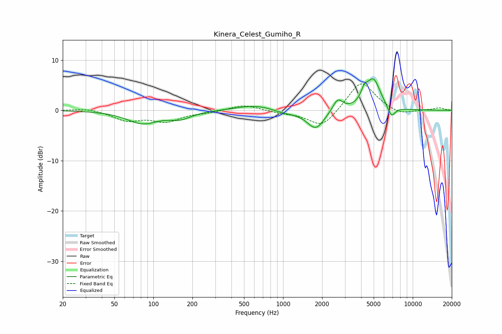

# Kinera_Celest_Gumiho_R
See [usage instructions](https://github.com/jaakkopasanen/AutoEq#usage) for more options and info.

### Parametric EQs
Apply preamp of -6.4 dB when using parametric equalizer.

|   # | Type    |   Fc (Hz) |    Q |   Gain (dB) |
|-----|---------|-----------|------|-------------|
|   1 | Peaking |        82 | 1.17 |        -2.5 |
|   2 | Peaking |       161 | 1.62 |        -1.4 |
|   3 | Peaking |       590 | 1.01 |         0.9 |
|   4 | Peaking |       756 | 1.08 |         0.3 |
|   5 | Peaking |      1023 | 1.26 |        -0.7 |
|   6 | Peaking |      1787 | 2.16 |        -3.7 |
|   7 | Peaking |      2639 | 3.73 |         2.4 |
|   8 | Peaking |      4231 | 5.41 |         2   |
|   9 | Peaking |      4972 | 2.54 |         6   |
|  10 | Peaking |      6841 | 4.54 |        -2.3 |

### Fixed Band EQs
When using fixed band (also called graphic) equalizer, apply preamp of **-5.4 dB** (if available) and set gains manually with these parameters.

|   # | Type    |   Fc (Hz) |    Q |   Gain (dB) |
|-----|---------|-----------|------|-------------|
|   1 | Peaking |        31 | 1.41 |         0.5 |
|   2 | Peaking |        62 | 1.41 |        -1.9 |
|   3 | Peaking |       125 | 1.41 |        -2   |
|   4 | Peaking |       250 | 1.41 |        -0.4 |
|   5 | Peaking |       500 | 1.41 |         1.2 |
|   6 | Peaking |      1000 | 1.41 |        -0.4 |
|   7 | Peaking |      2000 | 1.41 |        -3.5 |
|   8 | Peaking |      4000 | 1.41 |         6   |
|   9 | Peaking |      8000 | 1.41 |        -1   |
|  10 | Peaking |     16000 | 1.41 |         0.5 |

### Graphs

