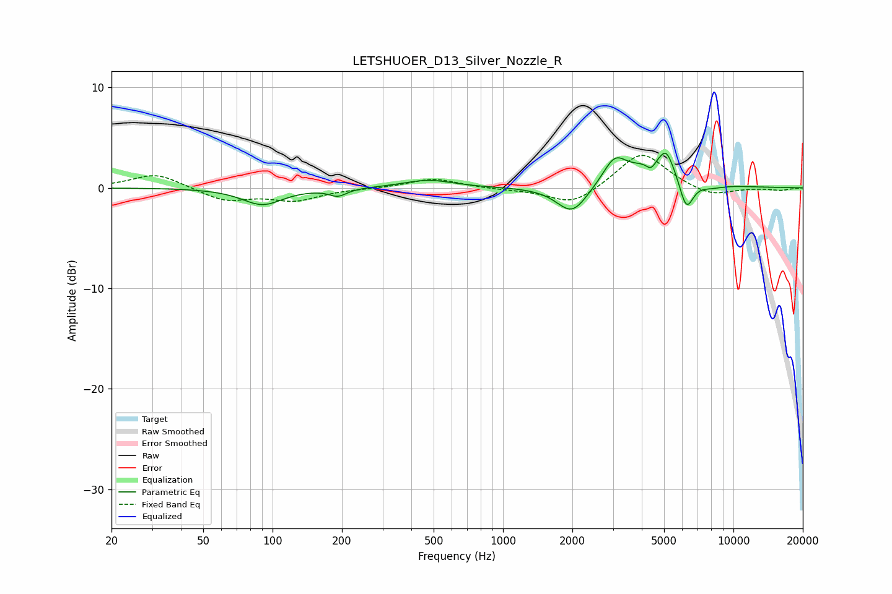

# LETSHUOER_D13_Silver_Nozzle_R
See [usage instructions](https://github.com/jaakkopasanen/AutoEq#usage) for more options and info.

### Parametric EQs
Apply preamp of -3.5 dB when using parametric equalizer.

|   # | Type    |   Fc (Hz) |    Q |   Gain (dB) |
|-----|---------|-----------|------|-------------|
|   1 | Peaking |        90 | 1.63 |        -1.7 |
|   2 | Peaking |       192 | 3.78 |        -0.7 |
|   3 | Peaking |       474 | 1.33 |         0.8 |
|   4 | Peaking |      1996 | 2.12 |        -2.8 |
|   5 | Peaking |      3052 | 2.79 |         2.5 |
|   6 | Peaking |      4397 | 6    |        -1.2 |
|   7 | Peaking |      4928 | 1.35 |         3.5 |
|   8 | Peaking |      5114 | 6    |         1.1 |
|   9 | Peaking |      6237 | 4.15 |        -3.8 |
|  10 | Peaking |      7861 | 2.14 |        -0.6 |

### Fixed Band EQs
When using fixed band (also called graphic) equalizer, apply preamp of **-3.3 dB** (if available) and set gains manually with these parameters.

|   # | Type    |   Fc (Hz) |    Q |   Gain (dB) |
|-----|---------|-----------|------|-------------|
|   1 | Peaking |        31 | 1.41 |         1.5 |
|   2 | Peaking |        62 | 1.41 |        -1.3 |
|   3 | Peaking |       125 | 1.41 |        -1.2 |
|   4 | Peaking |       250 | 1.41 |        -0   |
|   5 | Peaking |       500 | 1.41 |         0.9 |
|   6 | Peaking |      1000 | 1.41 |        -0.1 |
|   7 | Peaking |      2000 | 1.41 |        -1.8 |
|   8 | Peaking |      4000 | 1.41 |         3.7 |
|   9 | Peaking |      8000 | 1.41 |        -0.9 |
|  10 | Peaking |     16000 | 1.41 |        -0.2 |

### Graphs

