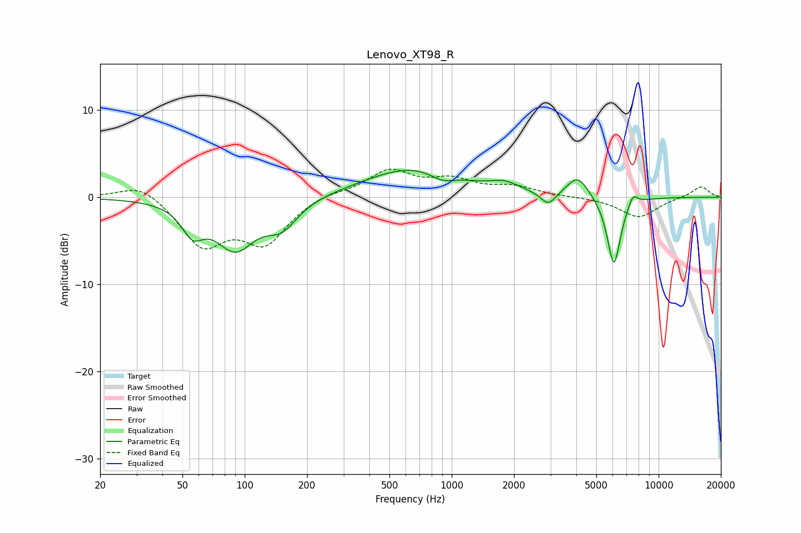

# Lenovo_XT98_R
See [usage instructions](https://github.com/jaakkopasanen/AutoEq#usage) for more options and info.

### Parametric EQs
Apply preamp of -3.2 dB when using parametric equalizer.

|   # | Type    |   Fc (Hz) |    Q |   Gain (dB) |
|-----|---------|-----------|------|-------------|
|   1 | Peaking |        56 | 2.73 |        -3   |
|   2 | Peaking |        90 | 1.45 |        -5.5 |
|   3 | Peaking |       151 | 1.86 |        -2.8 |
|   4 | Peaking |       656 | 0.61 |         3.4 |
|   5 | Peaking |       900 | 2.34 |        -1   |
|   6 | Peaking |      1812 | 2.09 |         0.9 |
|   7 | Peaking |      2931 | 3.85 |        -1.6 |
|   8 | Peaking |      4069 | 2.66 |         2.5 |
|   9 | Peaking |      6079 | 4.18 |        -8   |
|  10 | Peaking |      7510 | 5.91 |         1.3 |

### Fixed Band EQs
When using fixed band (also called graphic) equalizer, apply preamp of **-3.3 dB** (if available) and set gains manually with these parameters.

|   # | Type    |   Fc (Hz) |    Q |   Gain (dB) |
|-----|---------|-----------|------|-------------|
|   1 | Peaking |        31 | 1.41 |         1.8 |
|   2 | Peaking |        62 | 1.41 |        -5.3 |
|   3 | Peaking |       125 | 1.41 |        -4.9 |
|   4 | Peaking |       250 | 1.41 |         0.6 |
|   5 | Peaking |       500 | 1.41 |         3   |
|   6 | Peaking |      1000 | 1.41 |         1.7 |
|   7 | Peaking |      2000 | 1.41 |         1.1 |
|   8 | Peaking |      4000 | 1.41 |         0   |
|   9 | Peaking |      8000 | 1.41 |        -2.3 |
|  10 | Peaking |     16000 | 1.41 |         1.3 |

### Graphs

