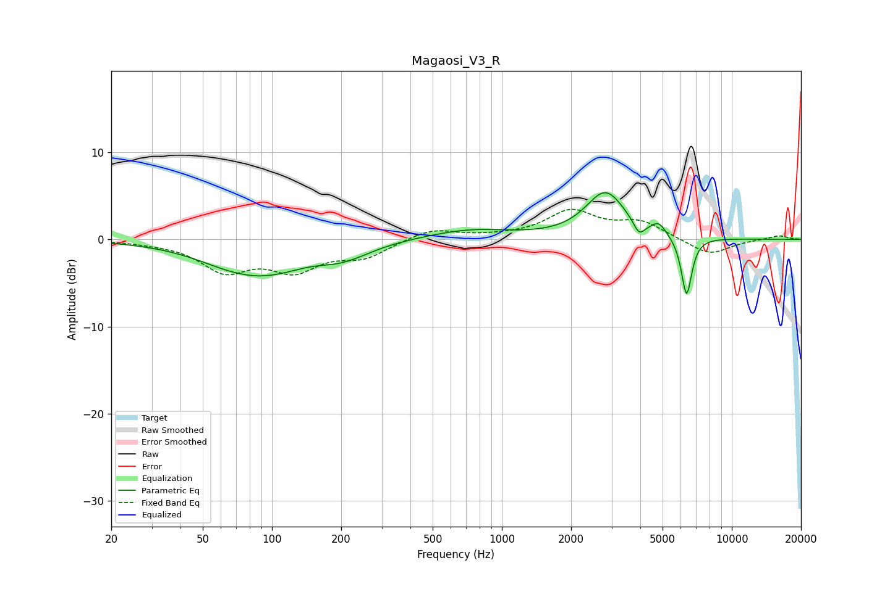

# Magaosi_V3_R
See [usage instructions](https://github.com/jaakkopasanen/AutoEq#usage) for more options and info.

### Parametric EQs
Apply preamp of -5.4 dB when using parametric equalizer.

|   # | Type    |   Fc (Hz) |    Q |   Gain (dB) |
|-----|---------|-----------|------|-------------|
|   1 | Peaking |        75 | 1.88 |         0.4 |
|   2 | Peaking |        85 | 0.76 |        -4.7 |
|   3 | Peaking |        93 | 1.84 |         0.3 |
|   4 | Peaking |       194 | 1.55 |        -0.9 |
|   5 | Peaking |       233 | 1.35 |        -0.6 |
|   6 | Peaking |       726 | 0.77 |         1.1 |
|   7 | Peaking |      2824 | 1.64 |         5.3 |
|   8 | Peaking |      3951 | 5.75 |        -1.5 |
|   9 | Peaking |      4819 | 4.47 |         1.3 |
|  10 | Peaking |      6358 | 6    |        -6.8 |

### Fixed Band EQs
When using fixed band (also called graphic) equalizer, apply preamp of **-3.5 dB** (if available) and set gains manually with these parameters.

|   # | Type    |   Fc (Hz) |    Q |   Gain (dB) |
|-----|---------|-----------|------|-------------|
|   1 | Peaking |        31 | 1.41 |        -0.2 |
|   2 | Peaking |        62 | 1.41 |        -3.4 |
|   3 | Peaking |       125 | 1.41 |        -3.2 |
|   4 | Peaking |       250 | 1.41 |        -1.8 |
|   5 | Peaking |       500 | 1.41 |         1.2 |
|   6 | Peaking |      1000 | 1.41 |         0.2 |
|   7 | Peaking |      2000 | 1.41 |         3.1 |
|   8 | Peaking |      4000 | 1.41 |         1.9 |
|   9 | Peaking |      8000 | 1.41 |        -1.8 |
|  10 | Peaking |     16000 | 1.41 |         0.5 |

### Graphs

