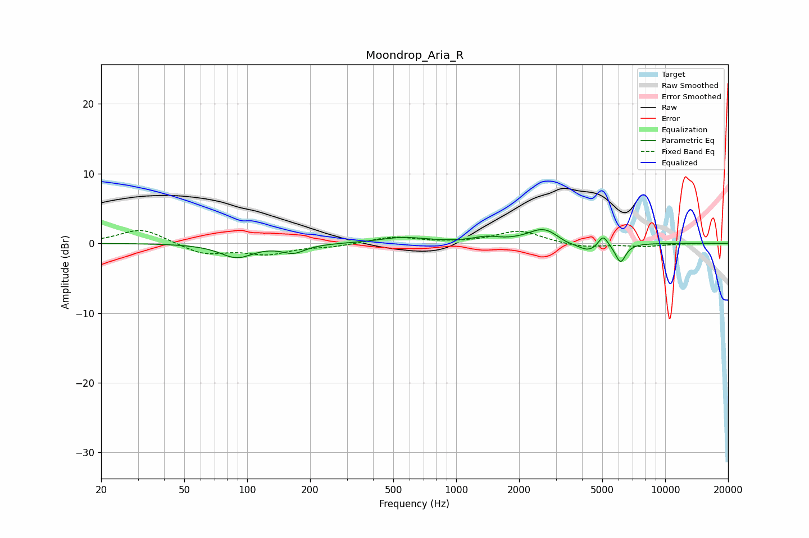

# Moondrop_Aria_R
See [usage instructions](https://github.com/jaakkopasanen/AutoEq#usage) for more options and info.

### Parametric EQs
Apply preamp of -2.1 dB when using parametric equalizer.

|   # | Type    |   Fc (Hz) |    Q |   Gain (dB) |
|-----|---------|-----------|------|-------------|
|   1 | Peaking |        89 | 1.81 |        -2   |
|   2 | Peaking |       167 | 2.53 |        -1.2 |
|   3 | Peaking |       553 | 1.8  |         0.1 |
|   4 | Peaking |       559 | 1.19 |         0.7 |
|   5 | Peaking |      1388 | 2.26 |         0.7 |
|   6 | Peaking |      2624 | 1.87 |         2.1 |
|   7 | Peaking |      3324 | 3.37 |        -0.4 |
|   8 | Peaking |      4294 | 2.61 |        -1.4 |
|   9 | Peaking |      5048 | 6    |         1.7 |
|  10 | Peaking |      6115 | 5.56 |        -2.7 |

### Fixed Band EQs
When using fixed band (also called graphic) equalizer, apply preamp of **-1.9 dB** (if available) and set gains manually with these parameters.

|   # | Type    |   Fc (Hz) |    Q |   Gain (dB) |
|-----|---------|-----------|------|-------------|
|   1 | Peaking |        31 | 1.41 |         2.2 |
|   2 | Peaking |        62 | 1.41 |        -1.6 |
|   3 | Peaking |       125 | 1.41 |        -1.4 |
|   4 | Peaking |       250 | 1.41 |        -0.4 |
|   5 | Peaking |       500 | 1.41 |         0.9 |
|   6 | Peaking |      1000 | 1.41 |         0   |
|   7 | Peaking |      2000 | 1.41 |         1.8 |
|   8 | Peaking |      4000 | 1.41 |        -0.6 |
|   9 | Peaking |      8000 | 1.41 |        -0.4 |
|  10 | Peaking |     16000 | 1.41 |        -0   |

### Graphs

