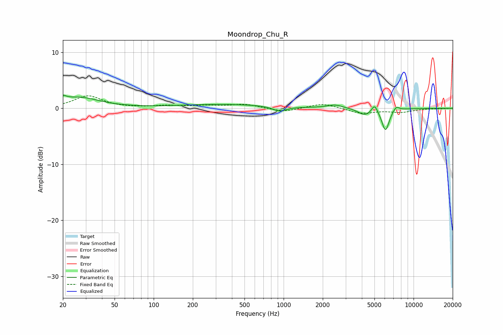

# Moondrop_Chu_R
See [usage instructions](https://github.com/jaakkopasanen/AutoEq#usage) for more options and info.

### Parametric EQs
Apply preamp of -2.4 dB when using parametric equalizer.

|   # | Type    |   Fc (Hz) |    Q |   Gain (dB) |
|-----|---------|-----------|------|-------------|
|   1 | Peaking |        20 | 5.71 |         0.8 |
|   2 | Peaking |        26 | 0.9  |         1.9 |
|   3 | Peaking |       360 | 0.36 |         0.7 |
|   4 | Peaking |       929 | 2.66 |        -0.9 |
|   5 | Peaking |      2491 | 2.34 |         0.6 |
|   6 | Peaking |      4182 | 2.91 |        -1   |
|   7 | Peaking |      4807 | 2.37 |        -0.3 |
|   8 | Peaking |      5007 | 6    |         1.6 |
|   9 | Peaking |      6082 | 4.89 |        -3.9 |
|  10 | Peaking |      7354 | 5.98 |         0.8 |

### Fixed Band EQs
When using fixed band (also called graphic) equalizer, apply preamp of **-2.3 dB** (if available) and set gains manually with these parameters.

|   # | Type    |   Fc (Hz) |    Q |   Gain (dB) |
|-----|---------|-----------|------|-------------|
|   1 | Peaking |        31 | 1.41 |         2.2 |
|   2 | Peaking |        62 | 1.41 |         0   |
|   3 | Peaking |       125 | 1.41 |         0.4 |
|   4 | Peaking |       250 | 1.41 |         0.4 |
|   5 | Peaking |       500 | 1.41 |         0.7 |
|   6 | Peaking |      1000 | 1.41 |        -0.7 |
|   7 | Peaking |      2000 | 1.41 |         0.9 |
|   8 | Peaking |      4000 | 1.41 |        -0.9 |
|   9 | Peaking |      8000 | 1.41 |        -0.6 |
|  10 | Peaking |     16000 | 1.41 |        -0   |

### Graphs

