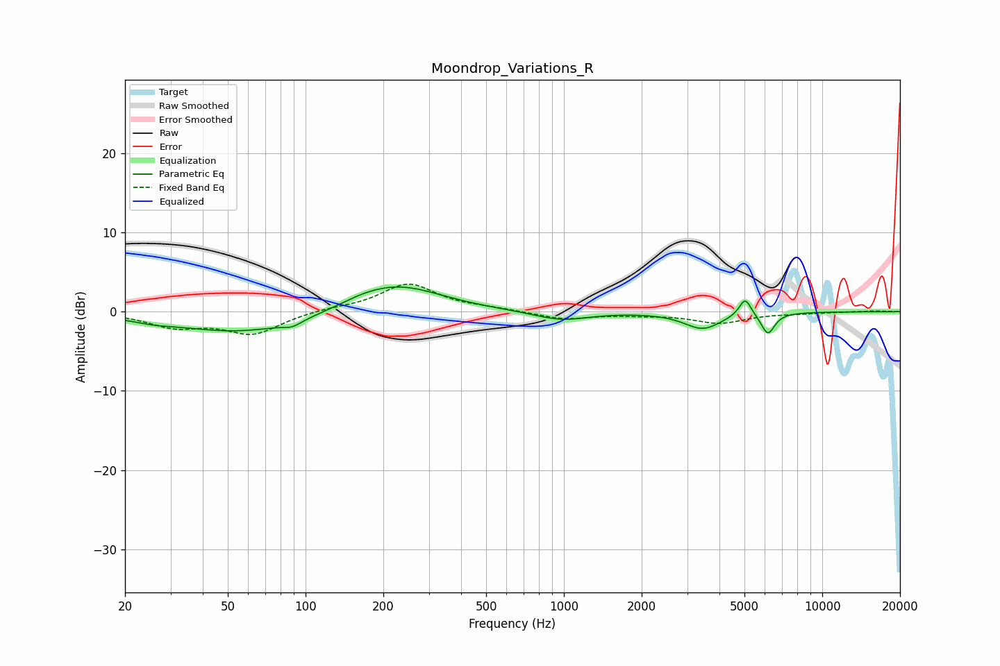

# Moondrop_Variations_R
See [usage instructions](https://github.com/jaakkopasanen/AutoEq#usage) for more options and info.

### Parametric EQs
Apply preamp of -3.2 dB when using parametric equalizer.

|   # | Type    |   Fc (Hz) |    Q |   Gain (dB) |
|-----|---------|-----------|------|-------------|
|   1 | Peaking |        26 | 1.97 |        -0.3 |
|   2 | Peaking |        57 | 0.53 |        -2.7 |
|   3 | Peaking |        89 | 3.97 |        -0.7 |
|   4 | Peaking |       161 | 1.85 |         0.3 |
|   5 | Peaking |       212 | 0.85 |         3.1 |
|   6 | Peaking |       279 | 0.9  |         0.6 |
|   7 | Peaking |       974 | 1.34 |        -1.1 |
|   8 | Peaking |      3446 | 1.97 |        -2.1 |
|   9 | Peaking |      5031 | 5.99 |         2.3 |
|  10 | Peaking |      6161 | 5.37 |        -2.7 |

### Fixed Band EQs
When using fixed band (also called graphic) equalizer, apply preamp of **-3.6 dB** (if available) and set gains manually with these parameters.

|   # | Type    |   Fc (Hz) |    Q |   Gain (dB) |
|-----|---------|-----------|------|-------------|
|   1 | Peaking |        31 | 1.41 |        -1.7 |
|   2 | Peaking |        62 | 1.41 |        -2.7 |
|   3 | Peaking |       125 | 1.41 |         0.4 |
|   4 | Peaking |       250 | 1.41 |         3.5 |
|   5 | Peaking |       500 | 1.41 |         0.3 |
|   6 | Peaking |      1000 | 1.41 |        -1   |
|   7 | Peaking |      2000 | 1.41 |        -0.3 |
|   8 | Peaking |      4000 | 1.41 |        -1.4 |
|   9 | Peaking |      8000 | 1.41 |        -0.2 |
|  10 | Peaking |     16000 | 1.41 |         0.1 |

### Graphs

