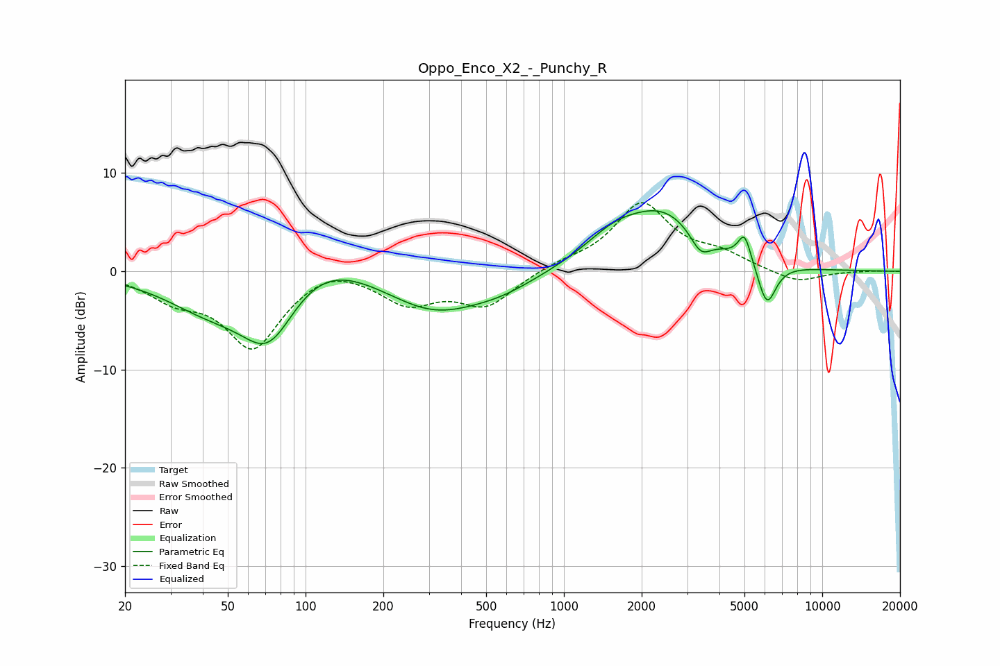

# Oppo_Enco_X2_-_Punchy_R
See [usage instructions](https://github.com/jaakkopasanen/AutoEq#usage) for more options and info.

### Parametric EQs
Apply preamp of -6.3 dB when using parametric equalizer.

|   # | Type    |   Fc (Hz) |    Q |   Gain (dB) |
|-----|---------|-----------|------|-------------|
|   1 | Peaking |        42 | 0.81 |        -3.2 |
|   2 | Peaking |        72 | 1.24 |        -7.5 |
|   3 | Peaking |       108 | 0.76 |         3.4 |
|   4 | Peaking |       314 | 0.74 |        -4   |
|   5 | Peaking |       577 | 1.03 |        -1.2 |
|   6 | Peaking |      1552 | 1.21 |         2.3 |
|   7 | Peaking |      2444 | 0.9  |         5.5 |
|   8 | Peaking |      3383 | 3.48 |        -2.1 |
|   9 | Peaking |      5006 | 5.65 |         2.9 |
|  10 | Peaking |      6109 | 3.88 |        -4.4 |

### Fixed Band EQs
When using fixed band (also called graphic) equalizer, apply preamp of **-7.1 dB** (if available) and set gains manually with these parameters.

|   # | Type    |   Fc (Hz) |    Q |   Gain (dB) |
|-----|---------|-----------|------|-------------|
|   1 | Peaking |        31 | 1.41 |        -2.3 |
|   2 | Peaking |        62 | 1.41 |        -7.6 |
|   3 | Peaking |       125 | 1.41 |         1.1 |
|   4 | Peaking |       250 | 1.41 |        -3   |
|   5 | Peaking |       500 | 1.41 |        -3.4 |
|   6 | Peaking |      1000 | 1.41 |         0.7 |
|   7 | Peaking |      2000 | 1.41 |         6.8 |
|   8 | Peaking |      4000 | 1.41 |         1.4 |
|   9 | Peaking |      8000 | 1.41 |        -1.2 |
|  10 | Peaking |     16000 | 1.41 |         0   |

### Graphs

