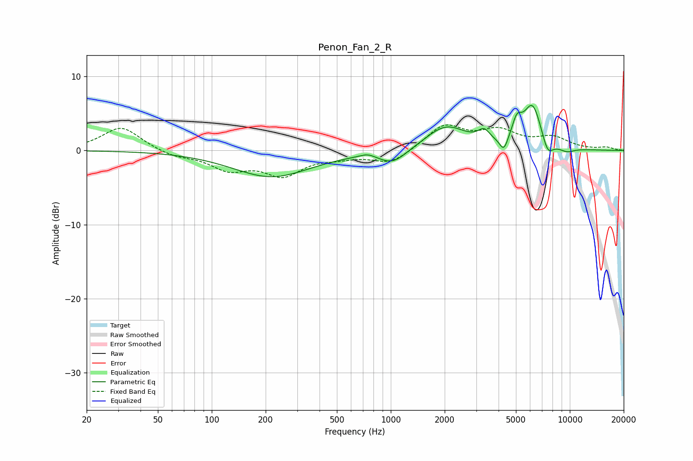

# Penon_Fan_2_R
See [usage instructions](https://github.com/jaakkopasanen/AutoEq#usage) for more options and info.

### Parametric EQs
Apply preamp of -6.2 dB when using parametric equalizer.

|   # | Type    |   Fc (Hz) |    Q |   Gain (dB) |
|-----|---------|-----------|------|-------------|
|   1 | Peaking |       216 | 0.65 |        -3.5 |
|   2 | Peaking |       743 | 3.27 |         0.5 |
|   3 | Peaking |      1025 | 1.78 |        -1.9 |
|   4 | Peaking |      2034 | 1.23 |         3.3 |
|   5 | Peaking |      3320 | 4.27 |         1.5 |
|   6 | Peaking |      4280 | 6    |        -1.9 |
|   7 | Peaking |      5059 | 5.11 |         2.5 |
|   8 | Peaking |      6187 | 2.65 |         5.9 |
|   9 | Peaking |      7518 | 4.33 |        -2.3 |
|  10 | Peaking |      9605 | 3.04 |        -0.6 |

### Fixed Band EQs
When using fixed band (also called graphic) equalizer, apply preamp of **-3.5 dB** (if available) and set gains manually with these parameters.

|   # | Type    |   Fc (Hz) |    Q |   Gain (dB) |
|-----|---------|-----------|------|-------------|
|   1 | Peaking |        31 | 1.41 |         3.2 |
|   2 | Peaking |        62 | 1.41 |        -0.8 |
|   3 | Peaking |       125 | 1.41 |        -2.3 |
|   4 | Peaking |       250 | 1.41 |        -3.1 |
|   5 | Peaking |       500 | 1.41 |        -0.7 |
|   6 | Peaking |      1000 | 1.41 |        -1.8 |
|   7 | Peaking |      2000 | 1.41 |         3.3 |
|   8 | Peaking |      4000 | 1.41 |         2.4 |
|   9 | Peaking |      8000 | 1.41 |         1.6 |
|  10 | Peaking |     16000 | 1.41 |         0.4 |

### Graphs

