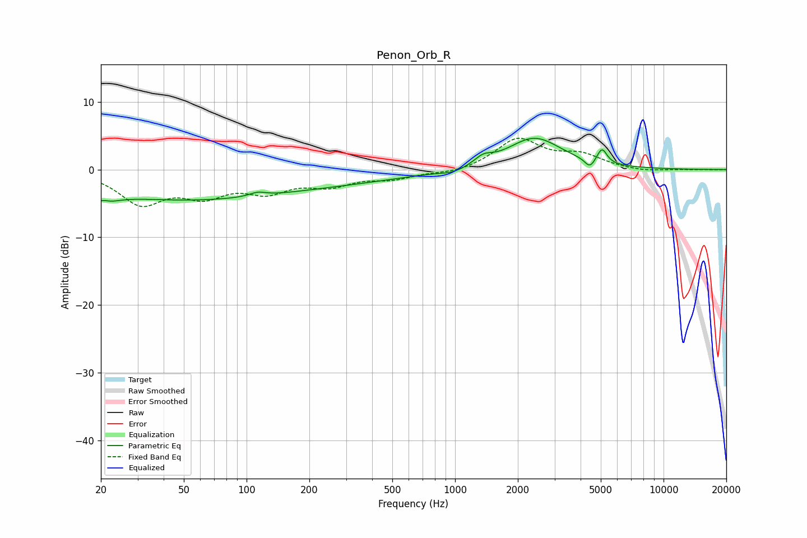

# Penon_Orb_R
See [usage instructions](https://github.com/jaakkopasanen/AutoEq#usage) for more options and info.

### Parametric EQs
Apply preamp of -4.7 dB when using parametric equalizer.

|   # | Type    |   Fc (Hz) |    Q |   Gain (dB) |
|-----|---------|-----------|------|-------------|
|   1 | Peaking |        20 | 2.81 |        -4.4 |
|   2 | Peaking |        20 | 3.81 |         3   |
|   3 | Peaking |        50 | 0.28 |        -4.3 |
|   4 | Peaking |       113 | 3.69 |         0.6 |
|   5 | Peaking |       332 | 0.44 |        -1.2 |
|   6 | Peaking |       981 | 2.26 |        -0.6 |
|   7 | Peaking |      1363 | 3.35 |         1.1 |
|   8 | Peaking |      2400 | 1.09 |         4.7 |
|   9 | Peaking |      4430 | 6    |        -1.3 |
|  10 | Peaking |      5068 | 6    |         2.2 |

### Fixed Band EQs
When using fixed band (also called graphic) equalizer, apply preamp of **-4.7 dB** (if available) and set gains manually with these parameters.

|   # | Type    |   Fc (Hz) |    Q |   Gain (dB) |
|-----|---------|-----------|------|-------------|
|   1 | Peaking |        31 | 1.41 |        -4.7 |
|   2 | Peaking |        62 | 1.41 |        -3.2 |
|   3 | Peaking |       125 | 1.41 |        -2.8 |
|   4 | Peaking |       250 | 1.41 |        -2   |
|   5 | Peaking |       500 | 1.41 |        -1.2 |
|   6 | Peaking |      1000 | 1.41 |        -0.6 |
|   7 | Peaking |      2000 | 1.41 |         4.5 |
|   8 | Peaking |      4000 | 1.41 |         1.9 |
|   9 | Peaking |      8000 | 1.41 |        -0.4 |
|  10 | Peaking |     16000 | 1.41 |        -0   |

### Graphs

