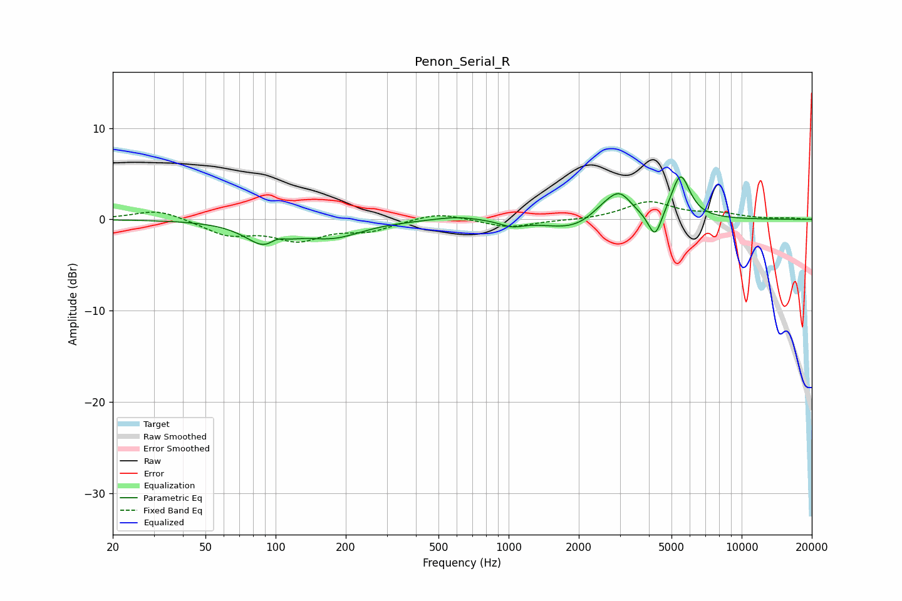

# Penon_Serial_R
See [usage instructions](https://github.com/jaakkopasanen/AutoEq#usage) for more options and info.

### Parametric EQs
Apply preamp of -4.7 dB when using parametric equalizer.

|   # | Type    |   Fc (Hz) |    Q |   Gain (dB) |
|-----|---------|-----------|------|-------------|
|   1 | Peaking |        92 | 1.7  |        -2.9 |
|   2 | Peaking |       101 | 3.76 |         1   |
|   3 | Peaking |       177 | 1.13 |        -1.7 |
|   4 | Peaking |       598 | 1.45 |         0.5 |
|   5 | Peaking |      1032 | 2.79 |        -0.6 |
|   6 | Peaking |      1896 | 1.23 |        -1.2 |
|   7 | Peaking |      2552 | 2.23 |         1.1 |
|   8 | Peaking |      2995 | 2.65 |         2.6 |
|   9 | Peaking |      4249 | 4.92 |        -3   |
|  10 | Peaking |      5464 | 3.45 |         4.9 |

### Fixed Band EQs
When using fixed band (also called graphic) equalizer, apply preamp of **-2.0 dB** (if available) and set gains manually with these parameters.

|   # | Type    |   Fc (Hz) |    Q |   Gain (dB) |
|-----|---------|-----------|------|-------------|
|   1 | Peaking |        31 | 1.41 |         1.1 |
|   2 | Peaking |        62 | 1.41 |        -1.6 |
|   3 | Peaking |       125 | 1.41 |        -2.1 |
|   4 | Peaking |       250 | 1.41 |        -1.1 |
|   5 | Peaking |       500 | 1.41 |         0.8 |
|   6 | Peaking |      1000 | 1.41 |        -0.9 |
|   7 | Peaking |      2000 | 1.41 |        -0.1 |
|   8 | Peaking |      4000 | 1.41 |         1.9 |
|   9 | Peaking |      8000 | 1.41 |         0.6 |
|  10 | Peaking |     16000 | 1.41 |         0.1 |

### Graphs

