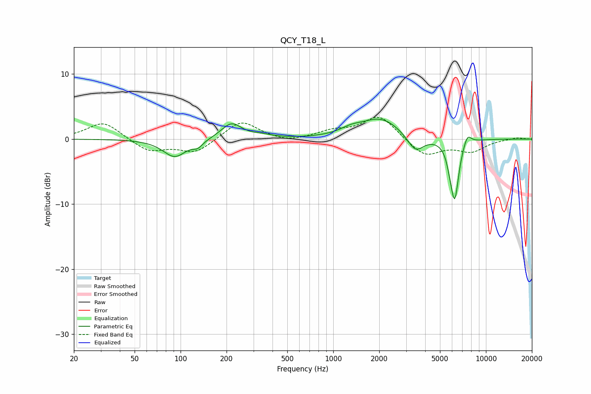

# QCY_T18_L
See [usage instructions](https://github.com/jaakkopasanen/AutoEq#usage) for more options and info.

### Parametric EQs
Apply preamp of -3.2 dB when using parametric equalizer.

|   # | Type    |   Fc (Hz) |    Q |   Gain (dB) |
|-----|---------|-----------|------|-------------|
|   1 | Peaking |        91 | 1.89 |        -2.7 |
|   2 | Peaking |       130 | 4.34 |        -0.9 |
|   3 | Peaking |       215 | 2.12 |         2.5 |
|   4 | Peaking |       340 | 2.13 |         0.4 |
|   5 | Peaking |      1304 | 1.99 |         0.8 |
|   6 | Peaking |      2053 | 1.08 |         3.1 |
|   7 | Peaking |      3452 | 2.62 |        -2.6 |
|   8 | Peaking |      5846 | 6    |        -1.6 |
|   9 | Peaking |      6256 | 5.15 |        -8.7 |
|  10 | Peaking |      7560 | 5.27 |         1.7 |

### Fixed Band EQs
When using fixed band (also called graphic) equalizer, apply preamp of **-3.4 dB** (if available) and set gains manually with these parameters.

|   # | Type    |   Fc (Hz) |    Q |   Gain (dB) |
|-----|---------|-----------|------|-------------|
|   1 | Peaking |        31 | 1.41 |         2.7 |
|   2 | Peaking |        62 | 1.41 |        -1.9 |
|   3 | Peaking |       125 | 1.41 |        -2.1 |
|   4 | Peaking |       250 | 1.41 |         2.9 |
|   5 | Peaking |       500 | 1.41 |        -0.6 |
|   6 | Peaking |      1000 | 1.41 |         1.1 |
|   7 | Peaking |      2000 | 1.41 |         3.6 |
|   8 | Peaking |      4000 | 1.41 |        -2.7 |
|   9 | Peaking |      8000 | 1.41 |        -1.8 |
|  10 | Peaking |     16000 | 1.41 |         0.3 |

### Graphs

