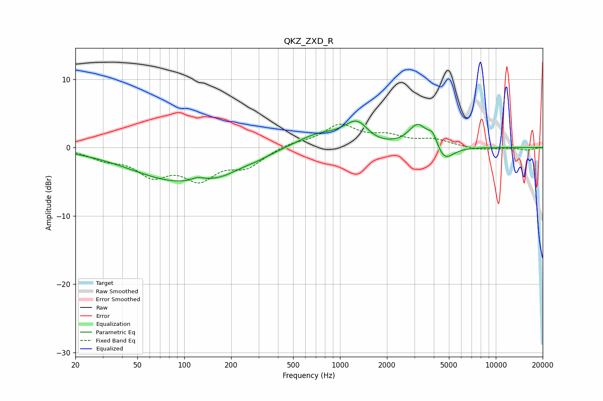

# QKZ_ZXD_R
See [usage instructions](https://github.com/jaakkopasanen/AutoEq#usage) for more options and info.

### Parametric EQs
Apply preamp of -4.0 dB when using parametric equalizer.

|   # | Type    |   Fc (Hz) |    Q |   Gain (dB) |
|-----|---------|-----------|------|-------------|
|   1 | Peaking |        94 | 0.45 |        -4.8 |
|   2 | Peaking |       122 | 3.33 |         0.6 |
|   3 | Peaking |       177 | 1.12 |        -0.9 |
|   4 | Peaking |       298 | 2.16 |        -0.2 |
|   5 | Peaking |       708 | 0.99 |         1.9 |
|   6 | Peaking |      1306 | 1.63 |         4.3 |
|   7 | Peaking |      1501 | 1.44 |        -1.4 |
|   8 | Peaking |      3155 | 2.44 |         3.2 |
|   9 | Peaking |      3939 | 4.41 |         2   |
|  10 | Peaking |      4649 | 2.42 |        -2.4 |

### Fixed Band EQs
When using fixed band (also called graphic) equalizer, apply preamp of **-3.5 dB** (if available) and set gains manually with these parameters.

|   # | Type    |   Fc (Hz) |    Q |   Gain (dB) |
|-----|---------|-----------|------|-------------|
|   1 | Peaking |        31 | 1.41 |        -1.4 |
|   2 | Peaking |        62 | 1.41 |        -3.6 |
|   3 | Peaking |       125 | 1.41 |        -4.1 |
|   4 | Peaking |       250 | 1.41 |        -2.5 |
|   5 | Peaking |       500 | 1.41 |         0.6 |
|   6 | Peaking |      1000 | 1.41 |         3.1 |
|   7 | Peaking |      2000 | 1.41 |         1.4 |
|   8 | Peaking |      4000 | 1.41 |         1   |
|   9 | Peaking |      8000 | 1.41 |        -0.4 |
|  10 | Peaking |     16000 | 1.41 |        -0.4 |

### Graphs

