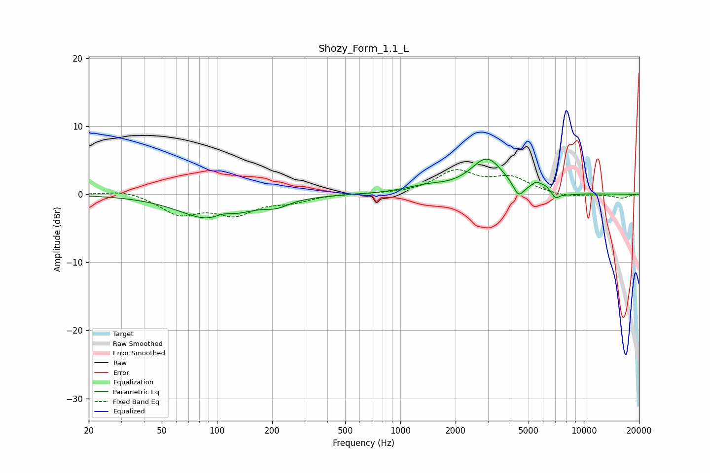

# Shozy_Form_1.1_L
See [usage instructions](https://github.com/jaakkopasanen/AutoEq#usage) for more options and info.

### Parametric EQs
Apply preamp of -5.3 dB when using parametric equalizer.

|   # | Type    |   Fc (Hz) |    Q |   Gain (dB) |
|-----|---------|-----------|------|-------------|
|   1 | Peaking |        96 | 0.82 |        -3.9 |
|   2 | Peaking |       108 | 2.69 |         0.9 |
|   3 | Peaking |       212 | 2.23 |        -0.9 |
|   4 | Peaking |      1386 | 1.21 |         0.9 |
|   5 | Peaking |      2969 | 1.56 |         5.1 |
|   6 | Peaking |      4408 | 4.93 |        -2   |
|   7 | Peaking |      5534 | 4.66 |         1.1 |
|   8 | Peaking |      6226 | 6    |         0.6 |
|   9 | Peaking |      7016 | 5.99 |        -1   |
|  10 | Peaking |      8161 | 2.31 |        -0.3 |

### Fixed Band EQs
When using fixed band (also called graphic) equalizer, apply preamp of **-3.7 dB** (if available) and set gains manually with these parameters.

|   # | Type    |   Fc (Hz) |    Q |   Gain (dB) |
|-----|---------|-----------|------|-------------|
|   1 | Peaking |        31 | 1.41 |         0.7 |
|   2 | Peaking |        62 | 1.41 |        -2.8 |
|   3 | Peaking |       125 | 1.41 |        -2.7 |
|   4 | Peaking |       250 | 1.41 |        -1   |
|   5 | Peaking |       500 | 1.41 |         0.1 |
|   6 | Peaking |      1000 | 1.41 |         0   |
|   7 | Peaking |      2000 | 1.41 |         3.2 |
|   8 | Peaking |      4000 | 1.41 |         2.2 |
|   9 | Peaking |      8000 | 1.41 |        -0.5 |
|  10 | Peaking |     16000 | 1.41 |        -0.6 |

### Graphs

