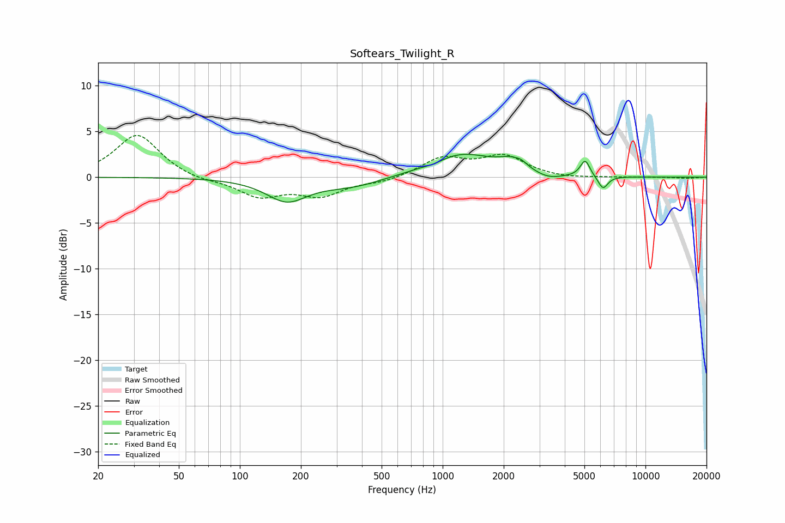

# Softears_Twilight_R
See [usage instructions](https://github.com/jaakkopasanen/AutoEq#usage) for more options and info.

### Parametric EQs
Apply preamp of -2.6 dB when using parametric equalizer.

|   # | Type    |   Fc (Hz) |    Q |   Gain (dB) |
|-----|---------|-----------|------|-------------|
|   1 | Peaking |       151 | 1.77 |         0.2 |
|   2 | Peaking |       169 | 1.4  |        -2.6 |
|   3 | Peaking |       356 | 0.94 |        -1   |
|   4 | Peaking |       908 | 3.06 |        -0.3 |
|   5 | Peaking |      1232 | 0.9  |         2.5 |
|   6 | Peaking |      2185 | 2.15 |         1.1 |
|   7 | Peaking |      2445 | 5.06 |         0.4 |
|   8 | Peaking |      3317 | 2.1  |        -0.6 |
|   9 | Peaking |      5041 | 5.99 |         1.8 |
|  10 | Peaking |      6176 | 5.74 |        -1.4 |

### Fixed Band EQs
When using fixed band (also called graphic) equalizer, apply preamp of **-4.7 dB** (if available) and set gains manually with these parameters.

|   # | Type    |   Fc (Hz) |    Q |   Gain (dB) |
|-----|---------|-----------|------|-------------|
|   1 | Peaking |        31 | 1.41 |         4.7 |
|   2 | Peaking |        62 | 1.41 |        -0.4 |
|   3 | Peaking |       125 | 1.41 |        -2   |
|   4 | Peaking |       250 | 1.41 |        -1.9 |
|   5 | Peaking |       500 | 1.41 |        -0.5 |
|   6 | Peaking |      1000 | 1.41 |         2   |
|   7 | Peaking |      2000 | 1.41 |         2.2 |
|   8 | Peaking |      4000 | 1.41 |        -0.2 |
|   9 | Peaking |      8000 | 1.41 |        -0   |
|  10 | Peaking |     16000 | 1.41 |        -0.1 |

### Graphs

